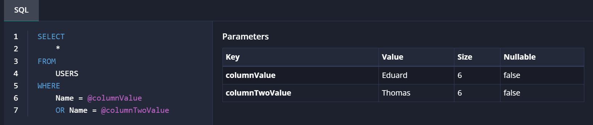

# How to get the SQL tab to show up

The elmah.io UI can offer to show any SQL code part of the current context of logging a message. The code will show up in the log message details as a tab named *SQL*:



The tab shows a formatted view of the SQL code including any parameters and/or syntax errors. This can help debug exceptions thrown while executing SQL code against a relational database.

To make the *SQL* tab show up, custom information needs to be included in the `Data` dictionary of a log message. The following sections will go into detail on how to include the custom information in various ways.

## Entity Framework Core

Entity Framework Core is easy since it already includes any SQL code as part of the messages logged through Microsoft.Extensions.Logging's `ILogger`. The SQL code and parameters are logged as two properties named `commandText` and `parameters`. elmah.io will automatically pick up these properties and show the *SQL* tab with the formatted results.

As a default, all values in parameters are not logged as part of the message. You will see this from values being set to `?` in the UI. To have the real values show up, you will need to enable sensitive data logging when setting up EF Core:

```csharp
services.AddDbContext<Context>(options =>
{
    // Other code like: options.UseSqlServer(connectionString);
    options.EnableSensitiveDataLogging(true); // ⬅️ Set this to true
});
```

This should not be set if you include sensitive details like social security numbers, passwords, and similar as SQL query parameters.

## Manually

If you want to attach SQL to a log message made manually, you can go one of two ways. The first way is to fill in the `commandText` and `parameters` Data entries shown above. When creating a message on `Elmah.Io.Client` it could look like this:

```csharp
client.Messages.CreateAndNotify(logId, new CreateMessage
{
    Title = "Log message with SQL attached",
    Severity = Severity.Error.ToString(),
    Data = new List<Item>
    {
        new Item
        {
            Key = "commandText",
            Value = "SELECT * FROM USERS WHERE Name = @columnValue OR Name = @columnTwoValue"
        },
        new Item
        {
            Key = "parameters",
            Value = "columnValue='Eduard' (Nullable = false) (Size = 6), columnTwoValue='Thomas' (Nullable = false) (Size = 6)"
        },
    },
});
```

The value of the `parameters` item needs to correspond to the format of that Entity Framework and the `System.Data` namespace uses.

The second approach is to provide elmah.io with a single Data item named `X-ELMAHIO-SQL`. The value of this item should be a JSON format as seen in the following example:

```csharp
var sql = new
{
    Raw = "SELECT * FROM USERS WHERE Name = @columnValue OR Name = @columnTwoValue",
    Parameters = new[]
    {
        new
        {
            IsNullable = false,
            Size = 6,
            Name = "columnValue",
            Value = "Eduard"
        },
        new
        {
            IsNullable = false,
            Size = 6,
            Name = "columnTwoValue",
            Value = "Thomas"
        },
    },
};
client.Messages.CreateAndNotify(logId, new CreateMessage
{
    Title = "Log message with SQL attached",
    Severity = Severity.Error.ToString(),
    Data = new List<Item>
    {
        new Item { Key = "X-ELMAHIO-SQL", Value = JsonConvert.SerializeObject(sql) },
    },
});
```

The JSON generated by serializing the anonymous object will look like this:

```json
{
    "Raw": "SELECT * FROM USERS WHERE Name = @columnValue OR Name = @columnTwoValue",
    "Parameters": [
        {
            "IsNullable": false,
            "Size": 6,
            "Name": "columnValue",
            "Value": "Eduard"
        },
        {
            "IsNullable": false,
            "Size": 6,
            "Name": "columnTwoValue",
            "Value": "Thomas"
        }
    ]
}
```