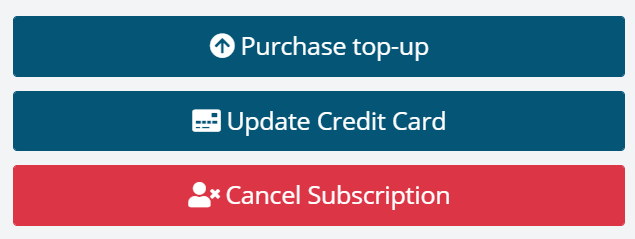

# How to manage subscriptions, update credit cards, etc.

Your subscription is managed from the organization settings page.

To open organization settings, click the gears icon next to your organization name on either the left menu or through the dashboard:

When on the organization settings page, click the _Subscription_ tab. Your subscription can be managed by scrolling to the bottom of the page and looking for the currently active subscription:

{: .image-400 }

In the following sections, we will go through each button.

## Purchase top-up

If getting near your monthly log message limit you can purchase a top-up to avoid having to permanently upgrade to a larger plan. Top-ups are priced at $19 and will add 25,000 messages and 1,000 emails to your subscription for the rest of the calendar month.

## Update Credit Card

If your recent payment failed or you received a new credit card from your bank, you can use this button to input the new credit card.

## Cancel Subscription

To cancel your current subscription you can click the Cancel Subscription button. This will open the chat where we will guide you through the process. We don't use a manual offboarding process to try and convince your to stay or to make it hard for you to leave. When leaving a system like elmah.io, we need additional details from you like when you want to cancel (mostly geared towards annual subscriptions) and to make sure that you have backed up all data from elmah.io before it is cleaned up.