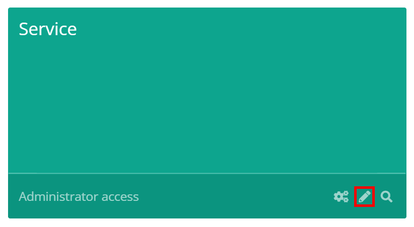

# How to rename a log

Logs can be renamed from the [Dashboard](https://app.elmah.io/dashboard/) by anyone with Administrator access to the log. To rename a log, click the small  icon in the lower right corner:

{: .image-500 }

When clicking the icon the log box will flip and you will be able to input a new name. The edit log box also lets you assign the log to an environment, subscribe/unsubscribe from emails, as well as change the color of the log. Be aware that changing the name, environment, or color will be visible to all users with access to the log.