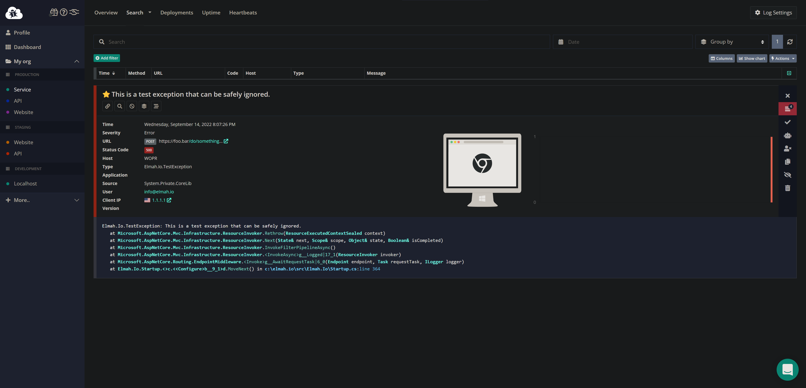

# How to run elmah.io in dark mode

Some developers prefer applications with a dark mode either full-time or when working those late hours. The elmah.io application (app.elmah.io) has a light theme but can be run in dark mode using a browser extension. We recommend the following extensions for running elmah.io in dark mode:

**Dark Mode - Night Eye** - [Chrome](https://chrome.google.com/webstore/detail/dark-mode-night-eye/alncdjedloppbablonallfbkeiknmkdi) - [Edge](https://microsoftedge.microsoft.com/addons/detail/dark-mode-night-eye/gijhmcgnnbcpigflkfoimbnfjnbcphah) - [Firefox](https://addons.mozilla.org/en-US/firefox/addon/night-eye-dark-mode/)

**Dark Reader** - [Chrome](https://chrome.google.com/webstore/detail/dark-reader/eimadpbcbfnmbkopoojfekhnkhdbieeh) - [Edge](https://microsoftedge.microsoft.com/addons/detail/dark-reader/ifoakfbpdcdoeenechcleahebpibofpc) - [Firefox](https://addons.mozilla.org/en-US/firefox/addon/darkreader/)

