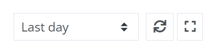

# How to show elmah.io dashboards on a big screen

There are several dashboards available on elmah.io that you'd want to put on a big screen. Showing live data from your production environment can be a good way to show when things start breaking. The following pages support kiosk mode with auto-refresh built-in:

- Dashboard
- Organization Overview
- Log Overview

Kiosk mode and auto-refresh can be enabled from the buttons in the top right corner of each screen:

{: .image-400 }

When enabling one or more buttons, the URL of the page will change to include those choices. We recommend building this URL locally and then copying the exact URL to the external system handling the output on the shared monitor. When loading a URL with kiosk mode enabled, elmah.io will automatically hide content from the page that you wouldn't need on a big screen like the cookie popup.

## FAQ

### Can I show a dashboard without logging in?

It is currently not possible to show dashboards in elmah.io without signing in. You can create a separate user for the shared monitor with read permissions only. This means that the technology you use to display the output on the shared monitor needs to be able to log into elmah.io somehow.

### The session keeps expiring on the external monitor

You can enable the *STAY SIGNED IN* toggle on the profile page of the user showing the elmah.io dashboard on the external monitor.