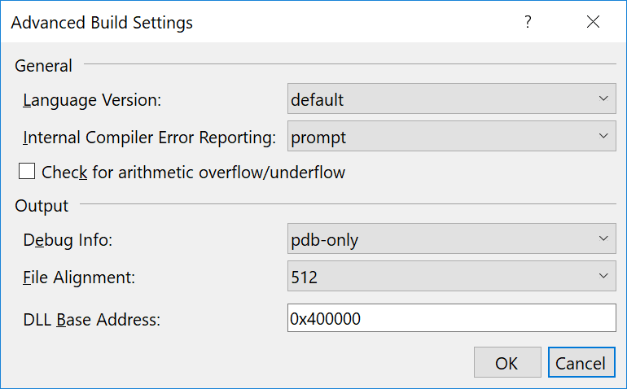

# Include filename and line number in stack traces

> If you are running .NET Core/.NET 5 you no longer need to enable filenames and line numbers manually.

When deploying your application to the test and production environment, you normally want to use the _Release_ configuration. When doing so, your code is optimized, web.config transformation is running, and a few additional things. But, part of running on a Release build is, that you lose the ability to see filenames and line numbers in the stack traces produced by your system.

.NET offers the concept of PDB files, which are automatically generated when building your code. The PDB file contains information for the debugger to work, like which file to look up when a breakpoint is reached in your code. Unless you have changed the default settings inside Visual Studio, both the Debug and Release configuration generates a PDB file.

So, if both Debug and Release produce a PDB file, why do Debug builds include file name and line number in stack traces, while the Release build doesn't? The reason is most often caused by the fact that PDB files aren't published as part of the deployment. To do so, right-click your project in Visual Studio and select _Properties_. Click the _Package/Publish Web_ tab and make sure that the _Release_ configuration is selected in the dropdown. Next, remove the checkmark in _Exclude generated debug symbols_:

Also, make sure that the PDB file is generated as part of Release builds. Select the _Build_ tab and click _Advanced..._. In _Debug Info_ you want to make sure that either `Pdb-only` or `Portable` is selected (`Pdb-only` being the default):

{: .image-500 }

On your next deployment, PDB files are published as part of the build.

> Depending on who you talk to, deploying PDB files as part of your build may be considered a hack. Since PDB files can contain sensitive information about your implementation, publishing these files should only be done, if you have full control of the environment you are deploying to. When releasing software to external users/customers, you don't want to include your PDB files. In this case, you should store the PDB files internally, in a symbol server or similar.