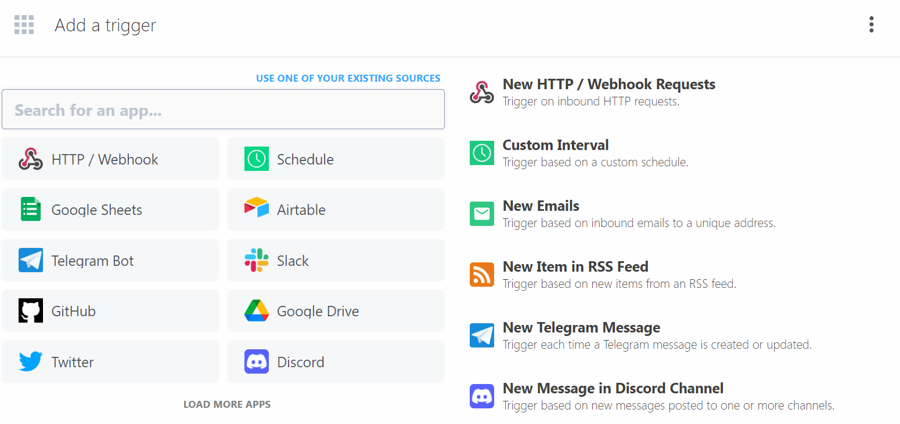
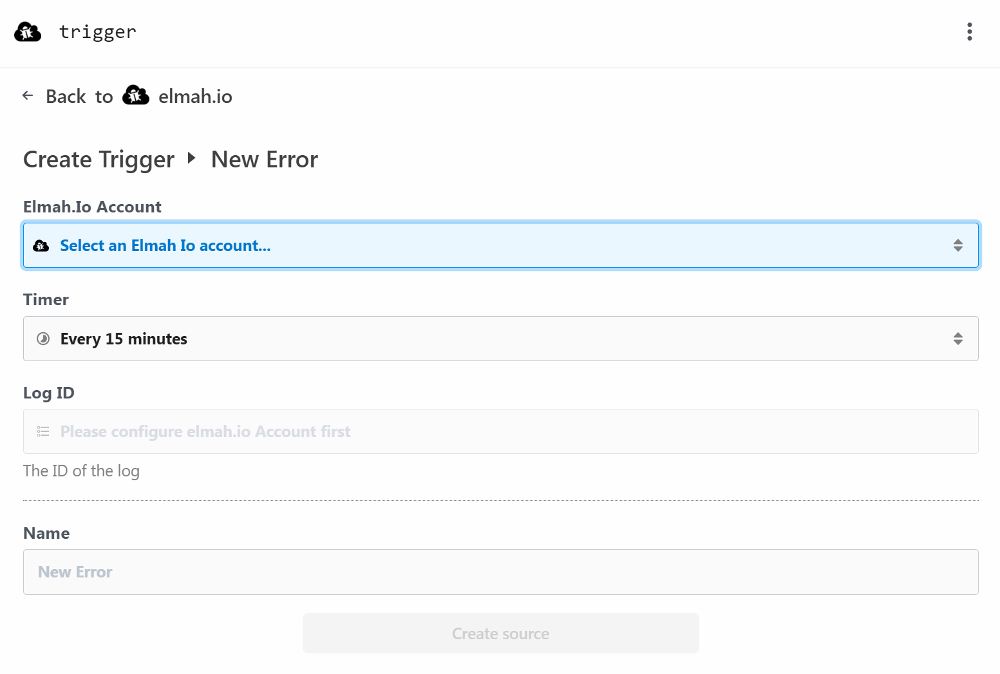
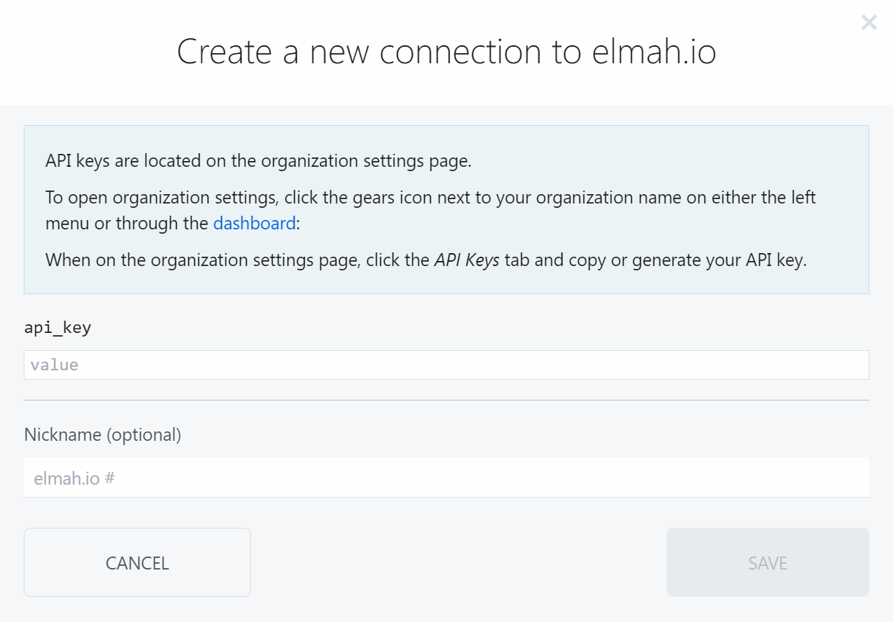
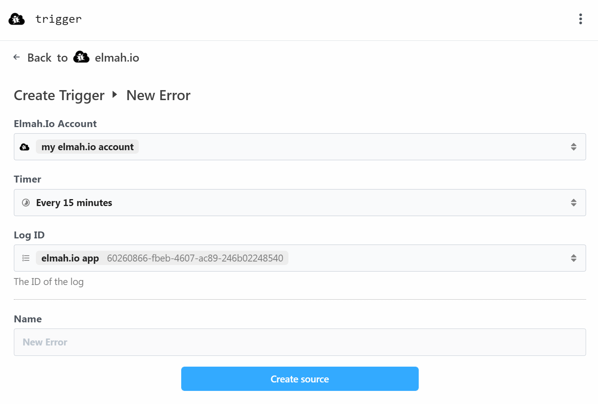
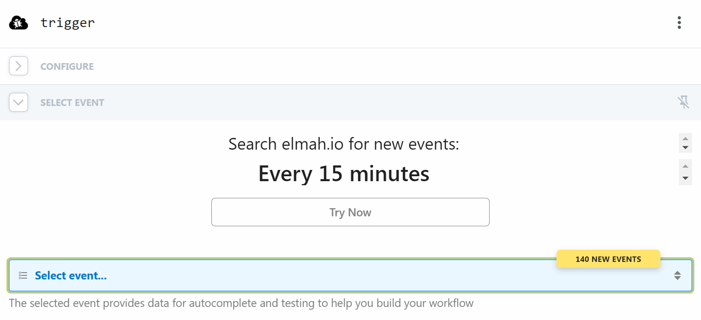

# Integrate with Pipedream

Pipedream is a service similar to Zapier and IFTTT to help integrate systems without having to write code. In this article, we use an integration point provided by elmah.io and Pipedream called a trigger. A trigger is something that triggers an action in Pipedream. In the case of elmah.io, the trigger available is when new errors are logged to your log. Actions exist on the other side of the integration and tell Pipedream what to do every time a trigger is fired. This guide will show you how to set up the trigger. What action you want to execute when new errors are logged will depend on the tools and workflows used in your organization.

Create a new account on pipedream.com. Then click the *New* button on the _Workflows_ page. The create new workflow page is shown:

Search for *elmah.io* in the search field and select the app and the *New Error* trigger:

Click the *Connect new account* button and input an API key with permission to both get logs and messages in the *api_key* field:

Click the *Save* button and select the log to integrate with in the *Log ID* dropdown:

Click the *Create source* button and wait for:

If no events are shown, force an error from the application integrated with the chosen log or create a test error through the API. Remember that only errors marked with the new flag are shown as events in Pipedream.

Select an event and click the *Continue* button. The elmah.io trigger is now configured. Select an app and event of your choice to create actions on the newly created trigger.