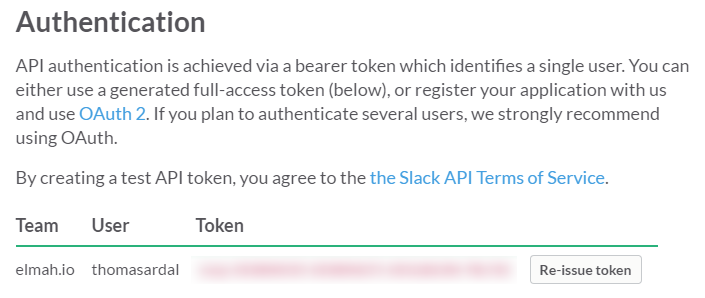
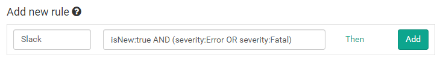
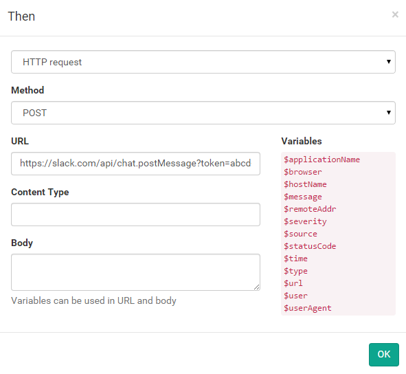
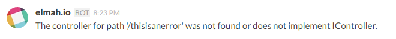

# Integrate with Slack

> This document is obsolete. You should integrate with Slack using our [Slack App](elmah-io-apps-slack.md). In fact, Slack recommend not sharing test tokens outside your company, why this guide probably will be deleted in the near future.

Start by copying your Slack-token from the [API page](https://api.slack.com/web). We will need this when setting up the integration.



On elmah.io, go to the Rules tab beneath your log settings. In this example we want a message on Slack every time a new error is logged in our elmah.io log. To do this, name your rule and input a query like illustrated on the following screenshot:



Hit the Then link and select HTTP request. Input the following values (remember to replace YOUR_TOKEN and YOUR_CHANNEL):

| Field | Value |
| :--- | :--- |
| Method | POST |
| URL | https://slack.com/api/chat.postMessage?token=YOUR_TOKEN&channel=YOUR_CHANNEL&text=$message&username=elmah.io |

The final result should look like this:



Don't worry about the empty Content-Type and Body. Everything needed to post the message to Slack is embedded into the URL. To learn more about the structure of the URL, jump to [Breaking it down](#breaking-it-down)

Click the OK button and add the new rule by clicking Add. This configuration tells elmah.io, to make a HTTP request against the Slack API, every time a new error is logged. The message at elmah.io is shown as the chat message inside Slack:



> Slack doesn't allow more than a single request per second. If you generate more than one message to elmah.io per second, not all of them will show up in Slack because of this.

## Breaking it down

You should have received a message on Slack already. To learn more about how to specify and extend the configuration for Slack, this is the section for you. Let's start by inspecting the simplest possible Slack URL:

`https://slack.com/api/chat.postMessage?token=xxxx-xxxxxxxxxx-xxxxxxxxxx-xxxxxxxxxxx-xxxxxxxxxx&channel=%23general&text=$message`

The initial part (`https://slack.com/api/chat.postMessage`) points out the method to invoke on Slack. In this case we want to post a new message (`chat.postMessage`). The `token` query parameter contains your access token as found on the [API page](https://api.slack.com/web).

The `channel` parameter contains the name or the ID of the channel you want to post the chat message to. In the example above, I specify the #general channel, but it can be any channel on your account. Observe how I've URL encoded the `#` character.

Next up is the `text` parameter which contains the actual message we want to post to #general. By inserting `$message`, I tell elmah.io to insert the title or headline of the logged message. In case of an exception, this will be the exception message generated at your website. elmah.io supports a range of variables, available on the Rules tab on the log settings.

To add a sender name other than `Bot`, add a `username` parameter like this: `&username=elmah.io`.

If you want a nice profile icon as well, you can append the following parameter: `&icon_url=https://elmah.io/icons/AppIcon50x50.png`. This tells Slack to show a nice elmah.io icon next to the chat messages.
