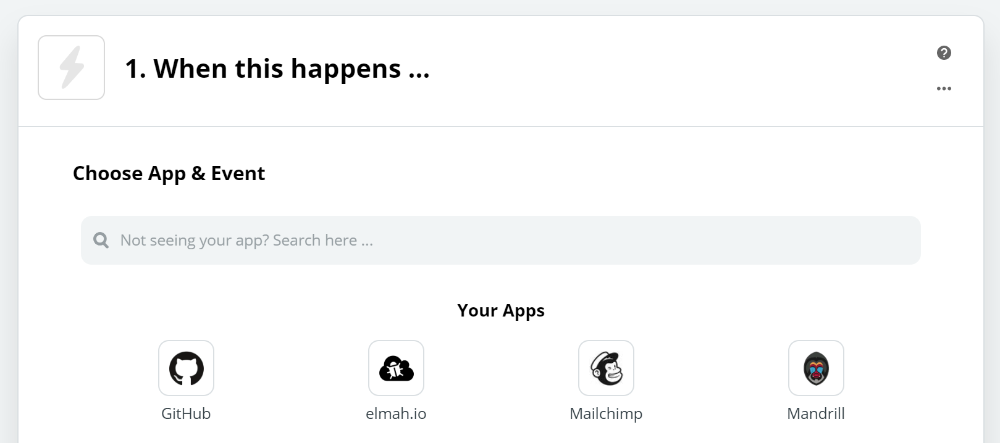
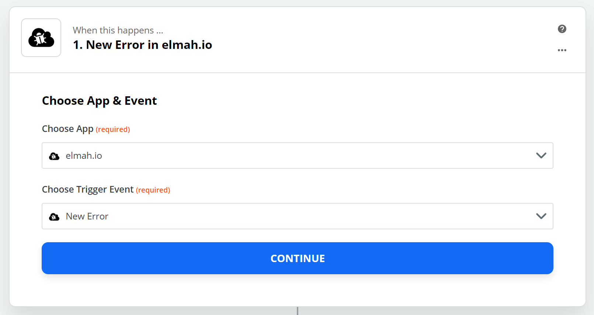
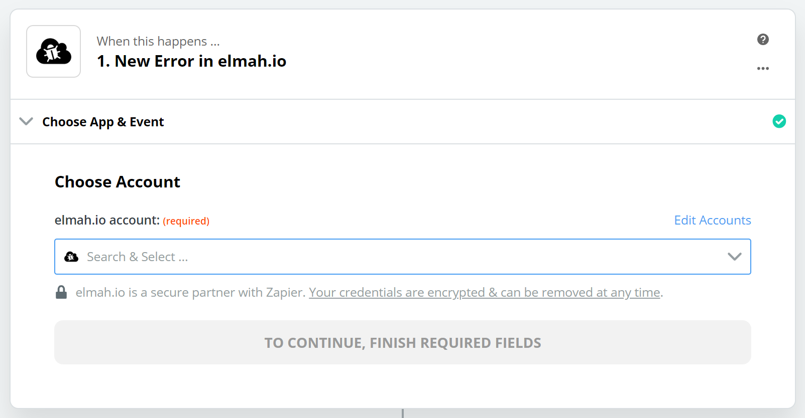
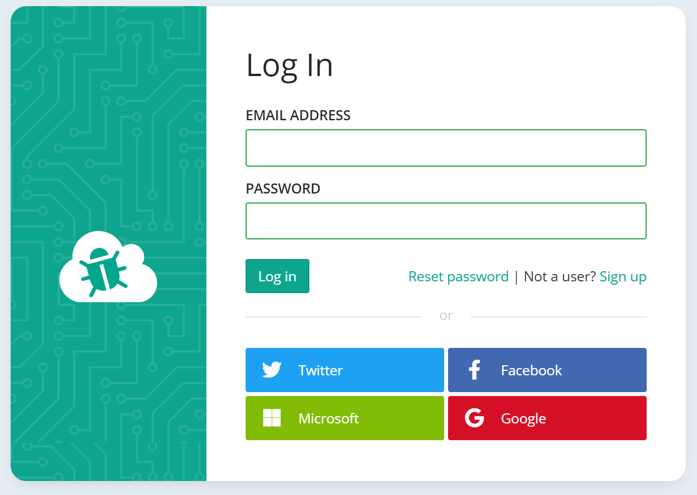
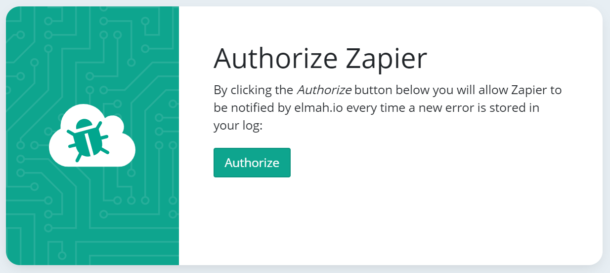
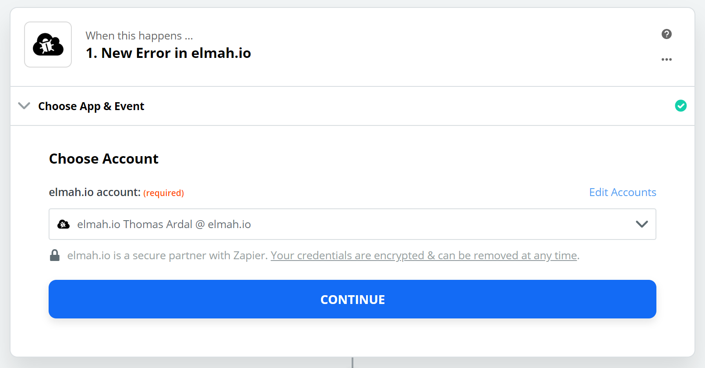
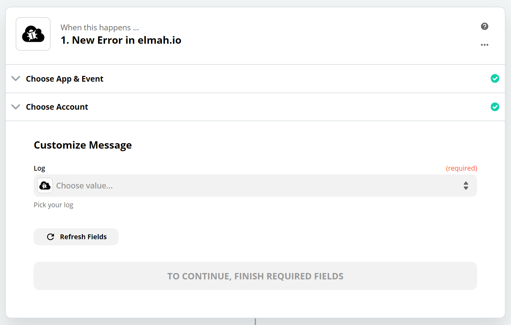
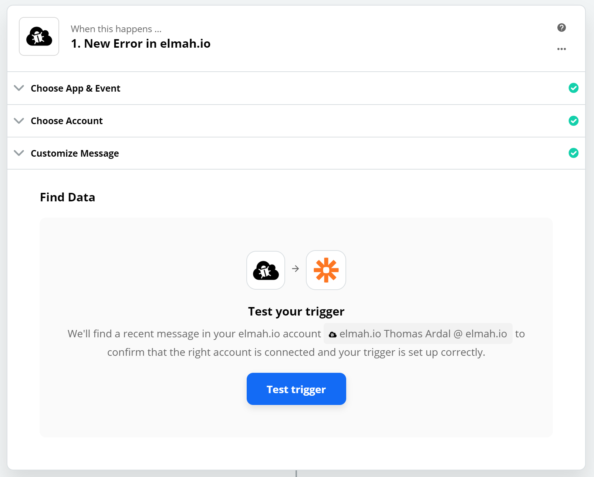

# Integrate with Zapier

Zapier is the place to go if you need to integrate two or more online systems. In this article, we use an integration point provided by elmah.io and Zapier called a trigger. A trigger is (as the name suggest) something that triggers an action in Zapier. In the case of elmah.io, the trigger available is when new errors are logged to your log. Actions exist on the other side of the integration and tell Zapier what to do every time a trigger is fired. This guide will show you how to set up the trigger. What action you want to execute when new errors are logged will depend on the tools and workflows used in your organization.

Create a new account on zapier.com. Then click the *Make a Zap* button. The create new Zap page is shown:

Search for *elmah.io* in the search field and select the app and the *New Error* trigger:

Click *Continue* and you will be presented with the following screen:

Click the search dropdown and select *Add a New Account* or select an existing account if you have already set up other zaps using elmah.io. Adding a new account will show a popup asking you to sign in to elmah.io:

Sign in with your elmah.io username/password or social provider. On the following screen you will be asked to authorize elmah.io to notify Zapier every time a new error is logged in a log selected on a later stage:

Click the *Authorize* button and your account will be added to the account list on Zapier:

Click *Continue*. In the following step you will select the elmah.io log that you want to integrate with Zapier:

The dropdown contains all of the logs you have access to within your organization. Select a log and click *Continue*. In the following step you will test the trigger:

Click *Test trigger* and Zapier will pull recent errors from the chosen log. Select the error the represents how a typical error in the chosen log looks like. The values from the chosen error will be used when filling in the action, why selecting a good example in this step can make it easier to configure later on.

When you are done, click the *Continue* button. The elmah.io trigger is now configured. Select an app and event of your choice to create actions on the newly created trigger.