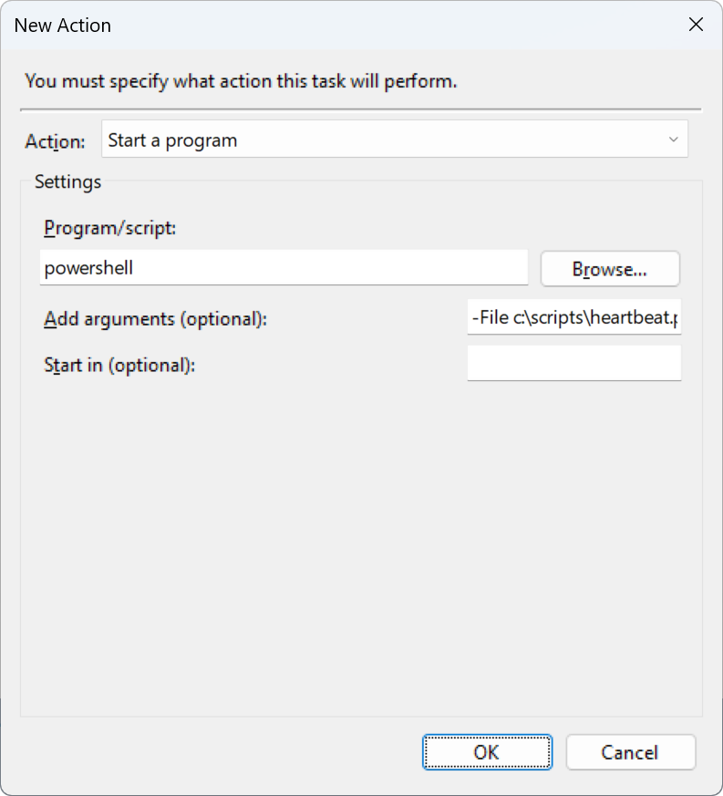

# Logging heartbeats from Windows Scheduled Tasks

How you want to implement heartbeats from Windows Scheduled Tasks depends on how your task is implemented. For tasks written in C#, you typically want to persist heartbeats using the `Elmah.Io.Client` package as shown in [Set up Heartbeats](/setup-heartbeats/). For scheduled PowerShell or other scripts, you can trigger the elmah.io API as shown in [Logging heartbeats from PowerShell](/logging-heartbeats-from-powershell/) and [Logging heartbeats from cURL](/logging-heartbeats-from-curl/).

Invoking the API either through the elmah.io client or using a REST client is the optimal way since you have greater control over what to log. This manual approach is not available when you are not in control of the scheduled code. Examples of this could be custom tools you install as Scheduled Tasks using `schtasks.exe` or tasks automatically registered when installing third-party software on your server.

When configuring a heartbeat through the elmah.io UI you set an expected interval and grace period. If a heartbeat is not received in time, we will automatically log a missing heartbeat error. This will indicate that the scheduled task didn't run or fail and is something that should be looked at. In case you want to log a failing heartbeat as soon as the scheduled task is failing, you can do that using events logged to the Windows Event Log. To set it up, go through the following steps:

* Open *Task Scheduler*.
* Go to *Task Scheduler Library* and click the *Create Task...* button.
* Give the new task a proper name.
* In the *Triggers* tab click the *New...* button.
* In the *New Trigger* window select *On an event* in the *Begin the task* dropdown.
* In *Settings* select the *Custom* radio button.
* Click the *New Event Filter...* button.
* Select the *XML* tab and check the *Edit query manually* checkbox.
* Now input the XML from the following screenshot (source code later in this article). The custom query will trigger on all *Application Error* messages from an app named *ConsoleApp14.exe*. You will need to change the app name to the filename of the app running in the scheduled task.

* Click the *OK* button.
* In the *New Trigger* window click the *OK* button to save the trigger.
* Select the *Actions* tab.
* Click the *New...* button.
* Select the *Start a program* option in the *Action* dropdown.
* Input values like shown here:

* Click the *OK* button to save the action.
* Click the *OK* button to save the task.
* The final step is to add the `c:\scripts\heartbeat.ps1` PowerShell script invoked by the task. For a better understanding of storing heartbeats through PowerShell check out [Logging heartbeats from PowerShell](/logging-heartbeats-from-powershell/). To log a failing heartbeat to elmah.io you can use the following PowerShell code:
```powershell
$apiKey = "API_KEY"
$logId = "LOG_ID"
$heartbeatId = "HEARTBEAT_ID"
$url = "https://api.elmah.io/v3/heartbeats/$logId/$heartbeatId/?api_key=$apiKey"

$body = @{
    result = "Unhealthy"
    reason = "Error in scheduled task"
}
Invoke-RestMethod -Method Post -Uri $url -Body ($body|ConvertTo-Json) -ContentType "application/json-patch+json"
```

That's it. The new task just created will trigger every time there's an application error from your application. Notice that in case your application is manually logging errors to the event log, this will also trigger the task.

Source code for reference:

```xml
<QueryList>
  <Query Id="0" Path="Application">
    <Select Path="Application">
*[System[Provider[@Name='Application Error']]]
and      
*[EventData[(Data[@Name="AppName"]="ConsoleApp14.exe")]]
    </Select>
  </Query>
</QueryList>
```