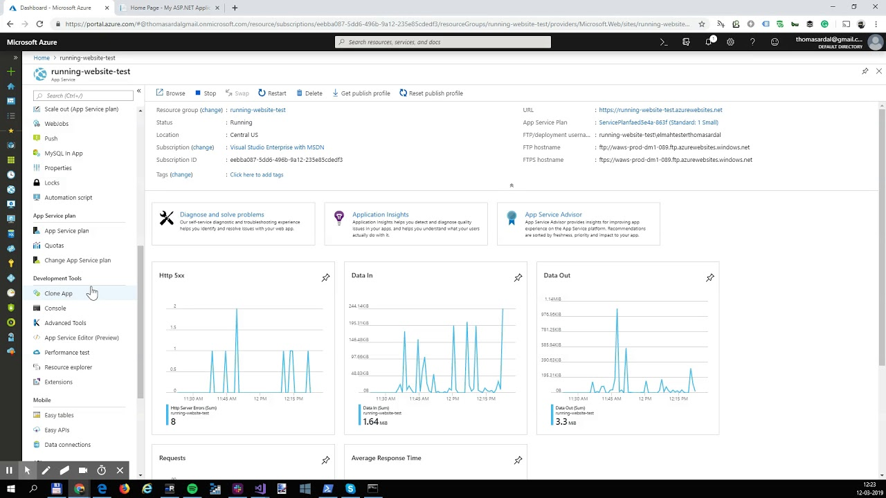
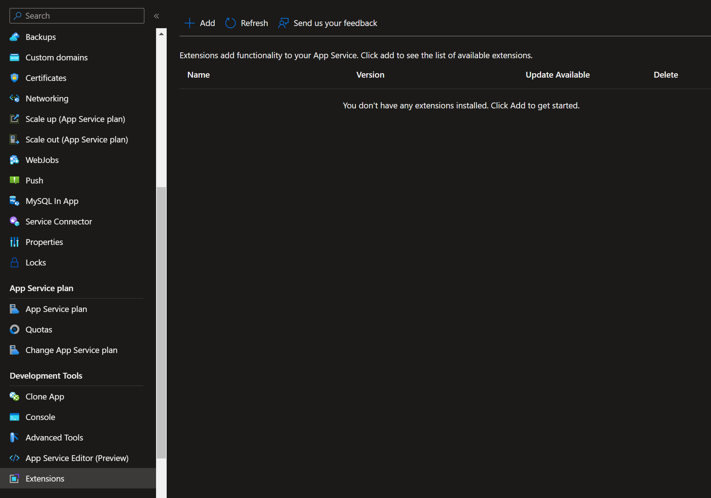
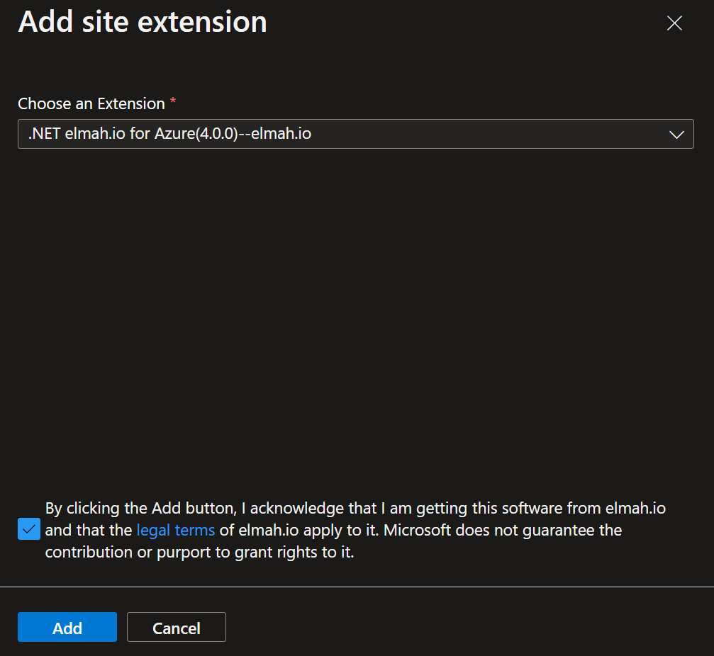
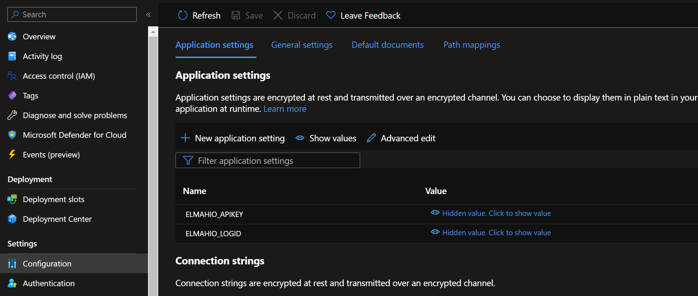

# Logging to elmah.io from a running website on Azure

> Adding elmah.io on a running website isn't the recommended way to install. It should be used if you are unable to deploy a new version only.

To enable error logging to elmah.io, you usually install one of our client integrations through PowerShell or Visual Studio and deploy a new version of your website to a web server. Sometimes you need to monitor an already running website or don't want logging logic as part of your repository. Using the elmah.io Site Extension for Azure App Services, error logging can be added to an already running website.

Check out this video tutorial or keep reading for the text version:

<a class="video-box" data-fancybox="" href="https://www.youtube.com/watch?v=R50FCpRtkjc&amp;autoplay=1&amp;rel=0" title="azure-apps-services">
  
  <i class="fad fa-play-circle"></i>
</a>

To start logging errors from your Azure web application, go to the Azure Portal and select the website you want to monitor. Click the *Extensions* tool:

Click the *Add* button and select **.NET elmah.io for Azure**:

Accept the terms and click the *Add* button. The elmah.io Site Extension is now added. Once added, restart the website for the new extension to load.

Finally, you need to add your API key ([Where is my API key?](https://docs.elmah.io/where-is-my-api-key/)) and log ID ([Where is my log ID?](https://docs.elmah.io/where-is-my-log-id/)) to *Application settings*:

Make sure to use the app setting names `ELMAHIO_APIKEY` and `ELMAHIO_LOGID`.

Your Azure web application now logs all uncaught exceptions to elmah.io. The elmah.io Site Extension comes with a couple of limitations:

- It only works for ASP.NET, MVC, Web API, and similar. ASP.NET Core websites should be installed locally and re-deployed.
- .NET Full Framework 4.6 and newer is required.
- Custom code or configuration may swallow exceptions. Like custom errors or when using the `HandleErrorAttribute` attribute in ASP.NET MVC. In this case, the correct NuGet package needs to be installed in your code and deployed to Azure (like the `Elmah.Io.Mvc` package for ASP.NET MVC).

## Troubleshooting

**ConfigurationErrorsException: Could not load file or assembly 'Elmah' or one of its dependencies. The system cannot find the file specified.**

After uninstalling the elmah.io site extension, you may see the configuration error above. This means that elmah.io's uninstall script for some reason wasn't allowed to run or resulted in an error.

To make sure that elmah.io is completely removed, follow these steps:

1. Stop your website.
2. Browse your website files through Kudu.
3. Remove all files starting with `Elmah`.
4. Start your website.