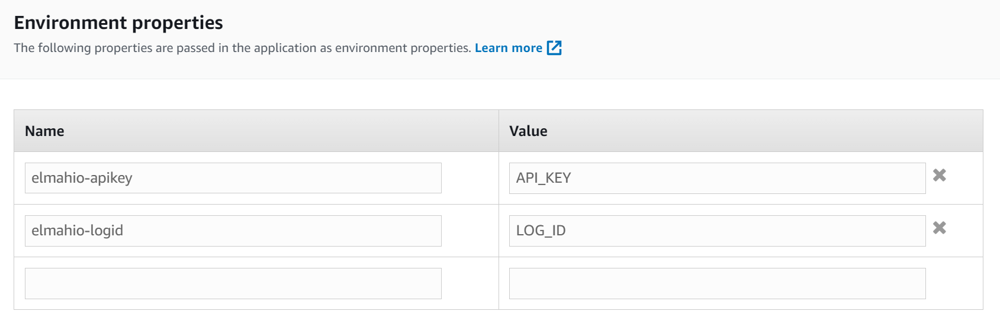

# Logging to elmah.io from AWS Beanstalk

[TOC]

Logging to elmah.io from .NET applications deployed on AWS Beanstalk is as easy as with other cloud hosting services. Since Beanstalk runs normal ASP.NET, MVC, Web API, and Core applications, setting up elmah.io almost follows the guides already available in the elmah.io documentation. There are a few things to notice when needing to configure elmah.io, which will be explained in this document.

## ASP.NET / MVC / Web API

To install elmah.io in [ASP.NET](https://docs.elmah.io/logging-to-elmah-io-from-elmah/), [MVC](https://docs.elmah.io/logging-to-elmah-io-from-aspnet-mvc/), and/or [Web API](https://docs.elmah.io/logging-to-elmah-io-from-web-api/), please follow the guidelines for each framework. You can specify one set of API key and log ID in the `Web.config` file and another set in the `Web.release.config` file as explained here: [Use multiple logs for different environments](https://docs.elmah.io/use-multiple-logs-for-different-environments/).

If you want to include your production API key and log ID on AWS only (to avoid having sensitive information in source control), you can do this using *Environment properties* on AWS. Go to your environment on the AWS console and click the *Configuration* tab. Click the *Edit* button beneath the *Software* category and scroll to the bottom. There you will see a section named *Environment properties*. Input your API key and log ID:



AWS inserts the properties as application settings in the `Web.config` file. To make sure that elmah.io uses API key and log ID from `appSettings`, change the `<elmah>` element to reference the keys specified on AWS:

```xml
<errorLog type="Elmah.Io.ErrorLog, Elmah.Io" apiKeyKey="elmahio-apikey" logIdKey="elmahio-logid" />
```

The `apiKeyKey` and `logIdKey` attributes reference the app settings keys.

Finally, if you have an API key and/or log ID specified as part of the `appSettings>` element in `Web.config`, you will need to remove those when running in production. The reason for this is that AWS only insert missing keys. To do so, modify your `Web.release.config` file:

```xml
<appSettings>
  <add key="elmahio-logid" xdt:Transform="Remove" xdt:Locator="Match(key)" />
  <add key="elmahio-apikey" xdt:Transform="Remove" xdt:Locator="Match(key)" />
</appSettings>
```

## ASP.NET Core

To install elmah.io in ASP.NET Core, follow this guide: [Logging to elmah.io from ASP.NET Core](https://docs.elmah.io/logging-to-elmah-io-from-aspnet-core/).

If you want to include your production API key and log ID on AWS only (to avoid having sensitive information in source control), you can do this using *Environment properties* on AWS. Go to your environment on the AWS console and click the *Configuration* tab. Click the *Edit* button beneath the *Software* category and scroll to the bottom. There you will see a section named *Environment properties*. Input your API key and log ID:


This example uses the double underscore syntax to set the `ApiKey` and `LogId` properties in the `appsettings.json` file:

```json
{
  "ElmahIo": {
    "ApiKey": "API_KEY",
    "LogId": "LOG_ID"
  }
}

```