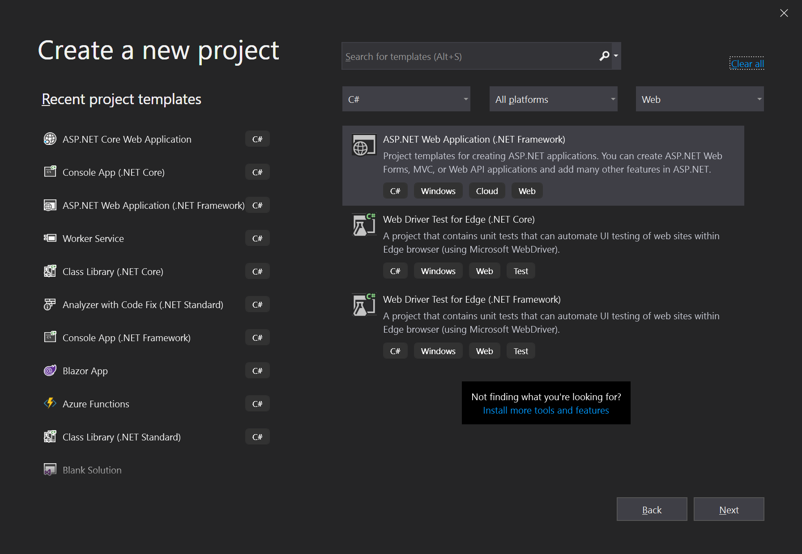
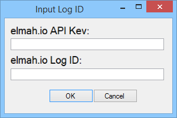

# Logging to elmah.io from ASP.NET / WebForms

This article will explain the steps necessary to log errors from your web application into elmah.io. We also offer more specific guides on [ASP.NET MVC](/logging-to-elmah-io-from-aspnet-mvc/), [Web API](/logging-to-elmah-io-from-web-api/), and a lot of other web- and logging-frameworks. Read through this tutorial and head over to a tutorial specific for your choice of framework afterwards.

This guide is also available as a short video tutorial here:

<a class="video-box" data-fancybox="" href="https://www.youtube.com/watch?v=OeQG2PkSpSE&amp;autoplay=1&amp;rel=0" title="elmah.io Introduction - Installation">
  
  <i class="fad fa-play-circle"></i>
</a>

Create a new *ASP.NET Web Application* in Visual Studio :

Select a project template of your choice:

Navigate to elmah.io and login using username/password or your favorite social provider. When logged in, elmah.io redirects you to the dashboard. If you just signed up, you will be guided through the process of creating an organization and a log.

When the log has been created, elmah.io shows you the install instructions. If you are currently on the dashboard, click the gears icon on the lower right corner of the log box. Don't pay too much attention to the install steps, because the rest of this tutorial will guide you through the installation. Keep the page open in order to copy your API key and log ID at a later step:

{: .image-400 }

Navigate back to your web project, right click _References_ and select _Manage NuGet Packages_:

In the NuGet dialog, search for elmah.io:

Select the `elmah.io` package and click *Install*. Input your API key and log ID in the dialog appearing during installation of the NuGet package:

You’re ready to rock and roll. Hit <kbd>F5</kbd> and input a URL you know doesn’t exist (like http://localhost:64987/notfound). You should see the standard 404 message displayed in the browser. To verify that the installation of elmah.io is successful, navigate back to the elmah.io dashboard and select the Search tab of your newly created log:

See the notfound error? Congrats! Every error on your application is now logged to elmah.io.
