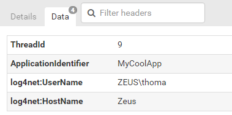

# Logging from Log4net


log4net is probably the oldest .NET logging frameworks on the block. Maintained by Apache and developed for more than a decade, makes log4net a good and well supported choice for some types of applications. log4net is based on the concept of appenders, which works pretty much like ELMAH’s error loggers. Unlike ELMAH, log4net can have multiple appenders, which makes it possible to log errors to multiple destinations. In addition log4net supports different log levels like Info and Warning. While ELMAH doesn’t have the concept of log levels, elmah.io supports all of the levels in log4net.

In this tutorial we’ll add log4net to an ASP.NET MVC project, but the process is almost identical with other project types. Create a new MVC project and install the elmah.io appender:

```powershell
Install-Package elmah.io.log4net
```

Add the following to your AssemblyInfo.cs file:

```csharp
[assembly: log4net.Config.XmlConfigurator(Watch = true)]
```

Add the following config section to your web.config file:

```xml
<section name="log4net" type="log4net.Config.Log4NetConfigurationSectionHandler, log4net" />
```

Finally, add the log4net configuration element to web.config:

```xml
<log4net>
  <appender name="ElmahIoAppender" type="elmah.io.log4net.ElmahIoAppender, elmah.io.log4net">
    <logId value="LOG_ID" />
  </appender>
  <root>
    <level value="Info" />
    <appender-ref ref="ElmahIoAppender" />
  </root>
</log4net>
```

That’s it! log4net is now configured and log messages to elmah.io. Remember to replace LOG_ID with your actual log Id. To start logging, write your usual log4net log statements:

```csharp
var log = log4net.LogManager.GetLogger(typeof(HomeController));
try
{
    log.Info("Trying something");
    throw new ApplicationException();
}
catch (ApplicationException ex)
{
    log.Error("Error happening", ex);
}
```

## Context Properties

log4net offers a feature called context properties. With context properties, you can log additional key/value pairs with every log message. The elmah.io appender for log4net, supports context properties as well. Context properties are handled like [custom properties](http://docs.elmah.io/logging-custom-data/) in the elmah.io UI.

Let's utilize two different hooks in log4net, to add context properties to elmah.io:

```csharp
log4net.GlobalContext.Properties["ApplicationIdentifier"] = "MyCoolApp";
log4net.ThreadContext.Properties["ThreadId"] = Thread.CurrentThread.ManagedThreadId;

log.Info("This is a message with custom properties");
```

Basically, we set two custom properties on contextual classes provided by log4net. To read more about the choices in log4net, check out the [log4net manual](https://logging.apache.org/log4net/release/manual/contexts.html).

When looking up the log message in elmah.io, we see the context properties in the Data tab:



Besides the two custom variables that we set through `GlobalContext` and `ThreadContext`, we see a couple of build-in properties in log4net, both prefixed with `log4net:`.
