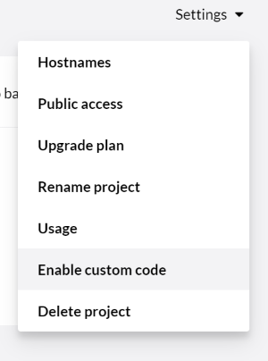

[](https://github.com/elmahio/elmah.io.umbraco/actions?query=workflow%3Abuild)
[](https://www.nuget.org/packages/elmah.io.umbraco/)
[](https://github.com/elmahio/elmah.io.umbraco/tree/main/samples)

# Logging to elmah.io from Umbraco

[TOC]

Since Umbraco itself is written in ASP.NET, ELMAH works like a dream inside Umbraco. Besides logging uncaught errors, elmah.io also supports other types of messages like information and debug. All the log levels that you already know from log4net, NLog, and Serilog, are supported on elmah.io as well. Logging in Umbraco CMS is based on Serilog, [which elmah.io also support](https://docs.elmah.io/logging-to-elmah-io-from-serilog/). We have brought all these pieces together into a NuGet package that we call: [Elmah.Io.Umbraco](https://www.nuget.org/packages/elmah.io.umbraco/).

<div class="alert alert-primary">
    <div class="row">
        <div class="col-auto align-self-start">
            <div class="fa fa-lightbulb"></div>
        </div>
        <div class="col">To learn more about the elmah.io integration with Umbraco and an overall introduction to the included features, make sure to check out the <a href="https://elmah.io/features/umbraco/">elmah.io and Umbraco</a> page.</div>
    </div>
</div>

To start utilizing elmah.io from your Umbraco site, all you need to do is install the `Elmah.Io.Umbraco` package:

```powershell fct_label="Package Manager"
Install-Package Elmah.Io.Umbraco
```
```cmd fct_label=".NET CLI"
dotnet add package Elmah.Io.Umbraco
```
```xml fct_label="PackageReference"
<PackageReference Include="Elmah.Io.Umbraco" Version="3.*" />
```
```xml fct_label="Paket CLI"
paket add Elmah.Io.Umbraco
```

During the installation, you will be asked for your API key ([Where is my API key?](https://docs.elmah.io/where-is-my-api-key/)) and log ID ([Where is my log ID?](https://docs.elmah.io/where-is-my-log-id/)).

Hit F5 and watch messages start flowing into elmah.io.

## What's inside?

The Elmah.Io.Umbraco package installs and configures three things:

* The elmah.io Serilog sink (Warning and above)
* An Umbraco content finder for logging 404's
* ELMAH with elmah.io as error log

All unhandled exceptions from both ASP.NET / MVC / Web API as well as 404's are logged automatically. Warnings, errors and fatal messages logged through Serilog are send to elmah.io as well.

## Configuration

If you are running on the default Umbraco template, all nessecary configuration is added during installation of the `Elmah.Io.Umbraco` NuGet package. If your `web.config` file for some reason aren't updated during installation, you can configure elmah.io manually: [Configure elmah.io manually](https://docs.elmah.io/configure-elmah-io-manually/). Likewise, the installer configure the elmah.io sink for Serilog in your `config\serilog.user.config` file.

### Different environments

You may have different environments like *Staging* and *Production*. At least you have two: *Localhost* and *Production*. If you want to log to different error logs depending on the current environment, check out [Use multiple logs for different environments](/use-multiple-logs-for-different-environments/). Web.config transformations work on the `Web.config` file only but you may have other config files that need transformation as well. In terms of elmah.io, the `serilog.user.config` file also includes elmah.io configuration that you may want to disable on localhost and include on production. If you are running on Umbraco Cloud this is natively supported as explained here: [Config Transforms](https://our.umbraco.com/documentation/Umbraco-Cloud/set-up/Config-Transforms/). Even in self-hosted environments, you can achieve something similar using the SlowCheetah extension. Check out this question on Our for details: [Deploying different umbracoSettings.config for different environments](https://our.umbraco.com/forum/umbraco-7/using-umbraco-7/57392-Deploying-different-umbracoSettingsconfig-for-different-environments).

## Umbraco Cloud

When using Umbraco Cloud, you may not have a local clone of the source code. To install elmah.io on Umbraco cloud, execute the following steps:

* Clone your Umbraco Cloud project to a local folder as explained here: <a href="https://our.umbraco.org/documentation/Umbraco-Cloud/Set-Up/Visual-Studio/" target="_blank">Visual Studio Setup</a>. Make sure to follow the instructions in that document and use `UaaS.cmd` to generate your local clone rather than cloning the project from Umbraco Cloud. All changes made in the following steps should be made in the `*.Web` project only and all commits from within that folder as well. Don't commit and push anything in the root folder.

* Install `Elmah.Io.Umbraco` into the `*.Web` project on your local clone. During the installation, you will be asked for your API key ([Where is my API key?](https://docs.elmah.io/where-is-my-api-key/)) and log ID ([Where is my log ID?](https://docs.elmah.io/where-is-my-log-id/)).

```powershell fct_label="Package Manager"
Install-Package Elmah.Io.Umbraco
```
```cmd fct_label=".NET CLI"
dotnet add package Elmah.Io.Umbraco
```
```xml fct_label="PackageReference"
<PackageReference Include="Elmah.Io.Umbraco" Version="3.*" />
```
```xml fct_label="Paket CLI"
paket add Elmah.Io.Umbraco
```

* Commit and push all changes to the git respository (only commit and push inside the `*.Web` folder). This will add elmah.io logging to your remote Umbraco Cloud project.

In case you want logging to different elmah.io logs from each Umbraco Cloud environment, please check out Umbraco's support for config transformations here: <a href="https://our.umbraco.org/documentation/Umbraco-Cloud/Set-Up/Config-Transforms/" target="_blank">Config transforms</a>.

## Umbraco Uno

Installing elmah.io in Umbraco Uno follow the process of installing it onto Umbraco Cloud. To modify code and configuration in Uno you will need an Umbraco Uno Standard plan or higher. Also, you need to enable *Custom Code* to clone the code locally. This can be done from Uno by clicking the *Enable custom code* button:



After enabling Custom Code you can create a *Development* environment and follow the steps in the [Umbraco Cloud](#umbraco-cloud) documentation.

## Umbraco 7

We still support Umbraco 7 through the `Elmah.Io.Umbraco` package version `3.2.35`:

```powershell fct_label="Package Manager"
Install-Package Elmah.Io.Umbraco -Version 3.2.35
```
```cmd fct_label=".NET CLI"
dotnet add package Elmah.Io.Umbraco --version 3.2.35
```
```xml fct_label="PackageReference"
<PackageReference Include="Elmah.Io.Umbraco" Version="3.2.35" />
```
```xml fct_label="Paket CLI"
paket add Elmah.Io.Umbraco --version 3.2.35
```

New features will be added to the updated package for Umbraco 8 and newer only.

## Umbraco Unicore

Playing with the alpha of the new version of Umbraco running on .NET Core? We are too. Luckily, elmah.io already provides all of the bits and pieces needed to integrate Umbraco Unicore and elmah.io.

Start by installing the `Elmah.Io.AspNetCore` package:

```powershell fct_label="Package Manager"
Install-Package Elmah.Io.AspNetCore
```
```cmd fct_label=".NET CLI"
dotnet add package Elmah.Io.AspNetCore
```
```xml fct_label="PackageReference"
<PackageReference Include="Elmah.Io.AspNetCore" Version="3.*" />
```
```xml fct_label="Paket CLI"
paket add Elmah.Io.AspNetCore
```

Then add the following code to the `ConfigureServices` method in the `Startup.cs` file:

```csharp
services.AddElmahIo(o =>
{
    o.ApiKey = "API_KEY";
    o.LogId = new Guid("LOG_ID");
});
```

Finally, add the following code to the `Configure` method before the call to `UseUmbraco`:

```csharp
app.UseElmahIo();
```

This will log all uncaught exceptions to elmah.io. If you want to hook into the internal logging of Umbraco, Install the `Elmah.Io.Extensions.Logging` package:

```powershell fct_label="Package Manager"
Install-Package Elmah.Io.Extensions.Logging
```
```cmd fct_label=".NET CLI"
dotnet add package Elmah.Io.Extensions.Logging
```
```xml fct_label="PackageReference"
<PackageReference Include="Elmah.Io.Extensions.Logging" Version="3.*" />
```
```xml fct_label="Paket CLI"
paket add Elmah.Io.Extensions.Logging
```

In the `ConfigureLogging` action in the `Program.cs` file add the following code after the call to `ClearProviders`:

```csharp
x.AddElmahIo(options =>
{
    options.ApiKey = "API_KEY";
    options.LogId = new Guid("LOG_ID");
});
x.AddFilter<ElmahIoLoggerProvider>(null, LogLevel.Warning);
```

This will log all warnings and above to elmah.io. You can adjust the `LogLevel` but be aware that Umbraco outputs a lot of log messages which will quickly fill up your monthly quota.