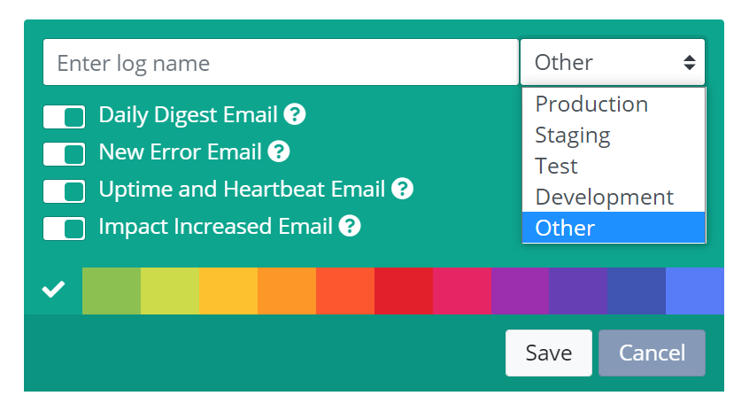
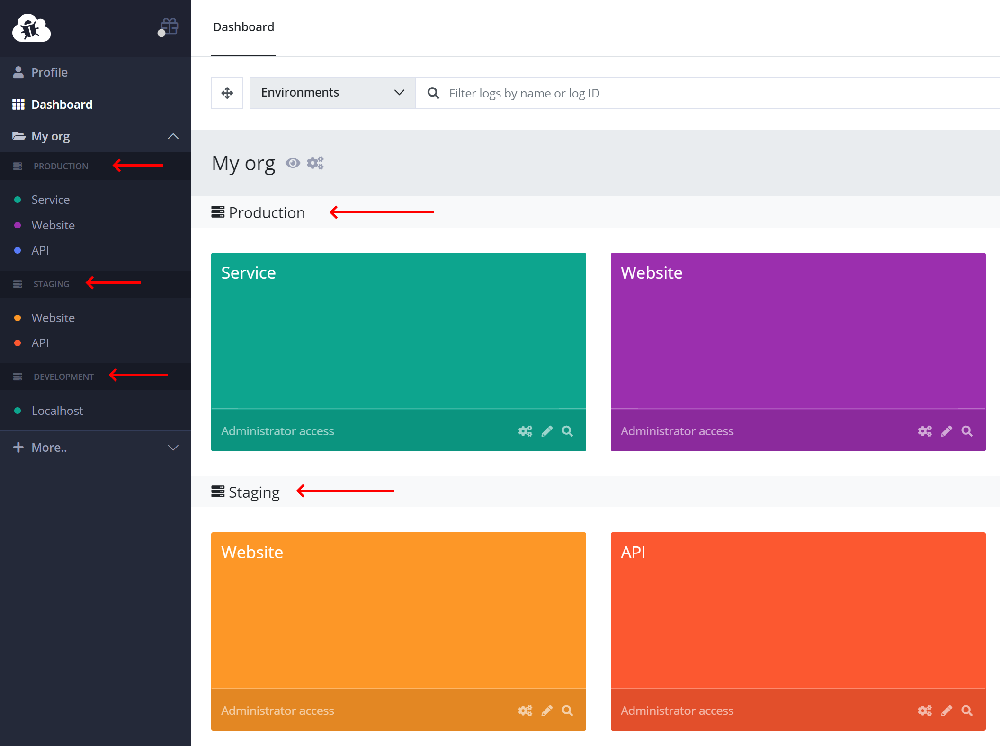
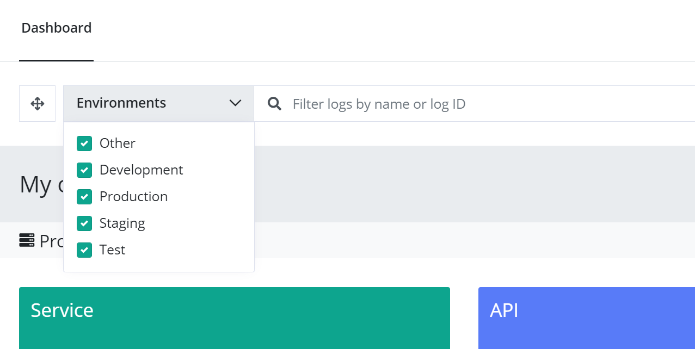
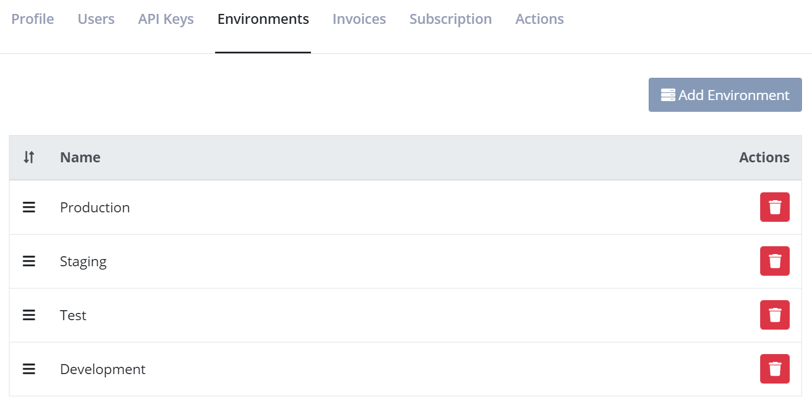

# Managing Environments

Environments is a grouping feature on elmah.io that will help you group similar logs together. By default you will have four environments in your organization: Development, Test, Staging, and Production. While this is the default view, additional environments can be added or environments named differently. The names don't need to match environments if you prefer a different naming scheme. Other ways to use environments would be to group logs by customers, departments, or servers.

When creating a new log from the elmah.io Dashboard, you can pick an environment in the dropdown:

{: .image-500 }

Once logs are added to environments, they are nicely grouped in the left menu and on the list of log boxes on the dashboard:

Logs can be ordered using the drag and drop button at the top but only inside the same environment. If you need to move a log to another environment, click *Edit* (the pencil icon on the log box) and select the new environment from the dropdown.

If you want to show logs within one or more specific environments on the dashboard, you can use the *Environments* dropdown:

{: .image-600 }

The list of environments can be managed from your organization settings page. To open organization settings, click the gears icon next to your organization name on either the left menu or through the dashboard:

Once on the organization settings page, select the *Environments* tab:

The order of environments can be changed using drag and drop. New environments can be created and existing ones deleted.