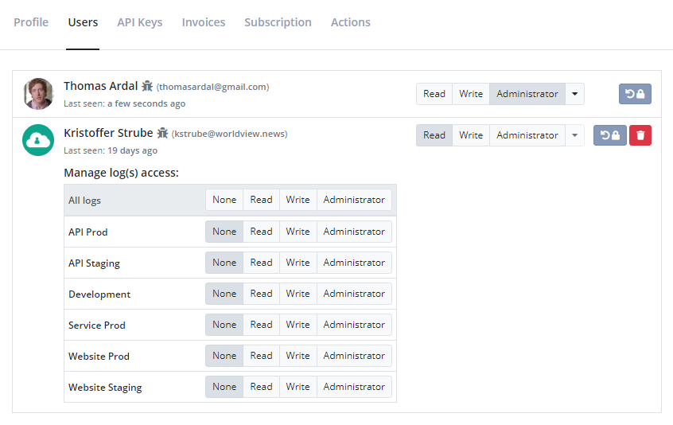
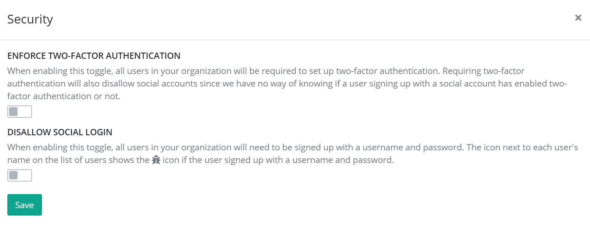

# Managing Organizations and Users

[TOC]

Chances are that you are not the only one needing to access your logs. Luckily, elmah.io offers great features to manage the users in your organization and to specify who should be allowed access to what.

This guide is also available as a short video tutorial here:

  <iframe class="embed-responsive-item" src="https://www.youtube.com/embed/7O43XBy4Kfg?rel=0" allowfullscreen></iframe>

To manage access, you will need to know about the concepts of **users** and **organizations**.

A **user** represents a person wanting to access one or more logs. Each user has its login using username/password or a social provider of choice. A user can be added to one or more organizations. Each user has an access level within the organization as well as an access level on each log. The access level on the organization and the logs doesn't need to be the same.

An **organization** is a collection of users and their roles inside the organization. You will typically only need a single organization, representing all of the users in your company needing to access one or more logs on elmah.io. Your elmah.io subscription is attached to your organization and everyone with administrator access to the organization will be able to manage the subscription.

## Adding existing users to an organization

To assign users to a log, you will need to add them to the organization first. When hovering the organization name in either the left menu or on the dashboard, you will see a small gear icon. When clicking the icon, you will be taken to the organization settings page:

At first, the user creating the organization will be the only one on the list. To add a new user to the list, click the *Add user* button and input the user's email or name in the textbox. The dropdown will show a list of users on elmah.io matching your query.

> Each user needs to sign up on elmah.io before being visible through *Add user*. Read on to learn how to invite new users.

When the new user is visible in the dropdown, click the user and select an access level. The chosen access level decides what the new user is allowed to do inside the organization. *Read* users are only allowed to view the organization, while *Administrator* users are allowed to add new users and delete the entire organization and all logs beneath it. The access level set for the user in the organization will become the user's access level on all new logs inside that organization as well. Let's add a new user to the organization:

To change the access level on an already added user, click one of the grouped buttons to the right of the user's name. Changing a user's access level on the organization won't change the user's access level on each log. To delete a user from the organization, click the red delete button to the far right.

When a user is added to an organization, the user will automatically have access to all new logs created in that organization. For security reasons, a new user added to the organization, will not have access to existing logs in the organization. To assign the new user to existing logs, assign an access level on each log shown beneath the user. The list of logs can be opened by clicking the dropdown button to the right of the user.

> Awarding a user *Administrator* on a log doesn't give them *Administrator* rights to the organization.

To assign a user to all logs, click the _None_, _Read_, _Write_, or _Administrator_ buttons in the table header above the list of logs.

## Invite new users to an organization

If someone not already created as a user on elmah.io needs access to your organization, you can use the *Invite* feature. Inviting users will send them an email telling them to sign up for elmah.io and automatically add them to your organization.

To invite a user click the *Invite user* button and input the new user's email. Select an organization access level and click the green *Invite user* button. This will add the new user to the organization and display it as "Invited" until the user signs up.

## Control security

You may have requirements of using two-factor authentication or against using social logins in your company. These requirements can be configured on elmah.io as well. Click the *Security* button above the user's list to set it up:

The toggles are documented through the UI. Here's an explanation for reference:

**Enforce two-factor authentication**

When enabling this toggle, all users in your organization will be required to set up two-factor authentication. Requiring two-factor authentication will also disallow social accounts since we have no way of knowing if a user signing up with a social account has enabled two-factor authentication or not.

**Disallow social login**

When enabling this toggle, all users in your organization will need to be signed up with a username and password. The icon next to each user's name on the list of users shows the bug icon if the user signed up with a username and password.