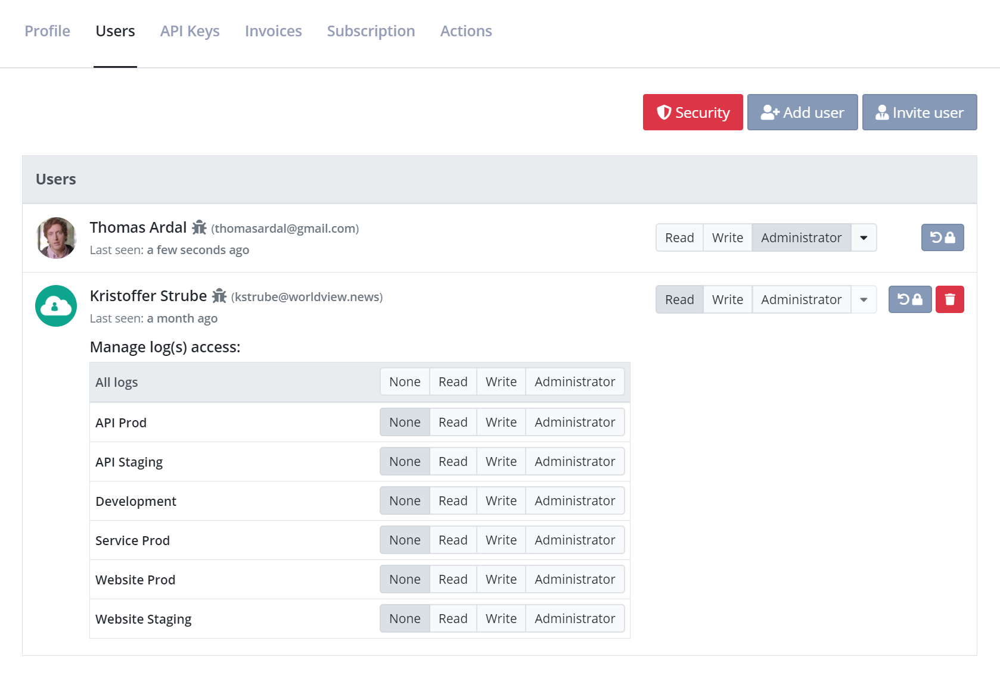

# Managing Organisations and Users

Chances are that you are not the only one needing to access your logs. Luckily elmah.io offers great features in order to manage the users in your organisation and to specify who should be allowed access to what. In order to manage access, you will need to know about the concepts of **users** and **organisations**.

A **user** represents a person wanting to access one or more logs. Each user has its own login using a social provider of choice. A user can be added to one or more organisations. Each user has an access level within the organisation as well as an access level on each log. The access level on the organisation and the logs doesn't need to be the same.

An **organisation** is a collection of users and their role inside the organisation. You will typically only need a single organisation, representing all of the users in your company needing to access one or more logs on elmah.io.

## Adding users to an organisation

To assign users to a log, you will need to add them to the organisation first. When hovering the organisation name in either the left menu or on the dashboard, you will see a small gear icon. When clicking the icon, you will be taken to the organisation settings page:



At first, the user creating the organisation will be the only one in the list. To add a new user to the list, input the users email or name in the textbox below *Add new user*. The dropdown will show a list of users on elmah.io matching your query.

> Each user needs to sign up on elmah.io before being visible in the *Add new user* list.

When the new user is visible in the dropdown, click the user and select an access level. The chosen access level decides what the new user is allowed to do inside the organisation. *Read* users are only allowed to view the organisation, while *Administrator* users are allowed to add new users and delete the entire organisation and all logs beneath it. The access level set on the user in the organisation, will become the users access level on all new logs inside that organisation as well. Let's add a new user to the organisation:

To change the access level on an already added user, click one of the grouped buttons to the right of the users name. Changing a users access level on the organisation wont change the users access level on each log. To delete a user from the organisation, click the dropdown to the far right and select *Remove from organisation*.

When a user is added to an organisation, the user will automatically have access to all new logs created in that organisation. For security reasons, a new user added to the organisatiom, will not have access to existing logs in the organisation. To assign the new user to all existing logs, click the dropdown next to the user and select *Add to all logs*. This will set the access level on all existing logs to the same level as specified on the user in the organisation. If the user is already added to one or more logs, the access level wont change on these logs when clicking *Add to all logs*.

## Adding users to a log

When added to the organisation, a user can be given different levels of access to each log. As mentioned above, all users inside the organisation will automatically have the same access level on each new logs, as configured on the user in the organisation.

To manage users on a log, hover the log on either the left menu or on the dashboard and click the gear icon. This will take you to the log settings page:

Both users in the organisation are now available on the log. Since I chose an existing log, the new user added to the organisation wont have access, indicated with the pressed *None* button. To assign the new user to this log, click one of the other grouped buttons.

Like in the organisation settings, different access levels are available for users on a log. It's perfectly fine to change this, since you probably want users with only *Read* access on the organisation level, but *Write* or *Administrator* access to one or more logs. Being *Administrator* on a log, means that the user is able to perform user administration and other "dangerous" functions on that log.

> Awarding a user *Administrator* on a log, doesn't give them *Administrator* rights on the organisation.