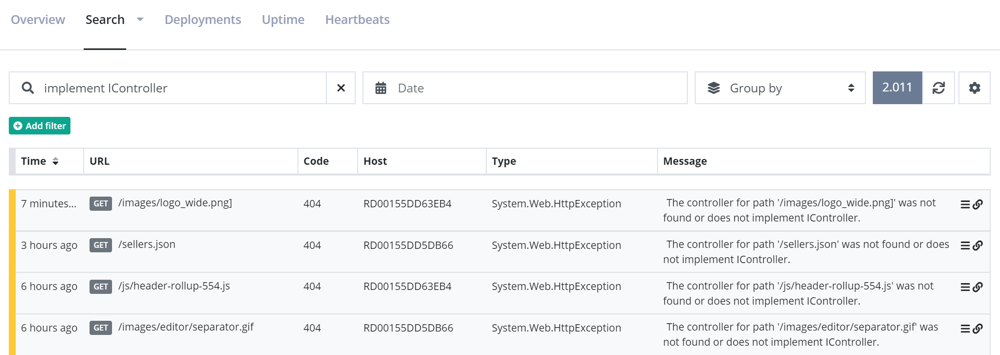
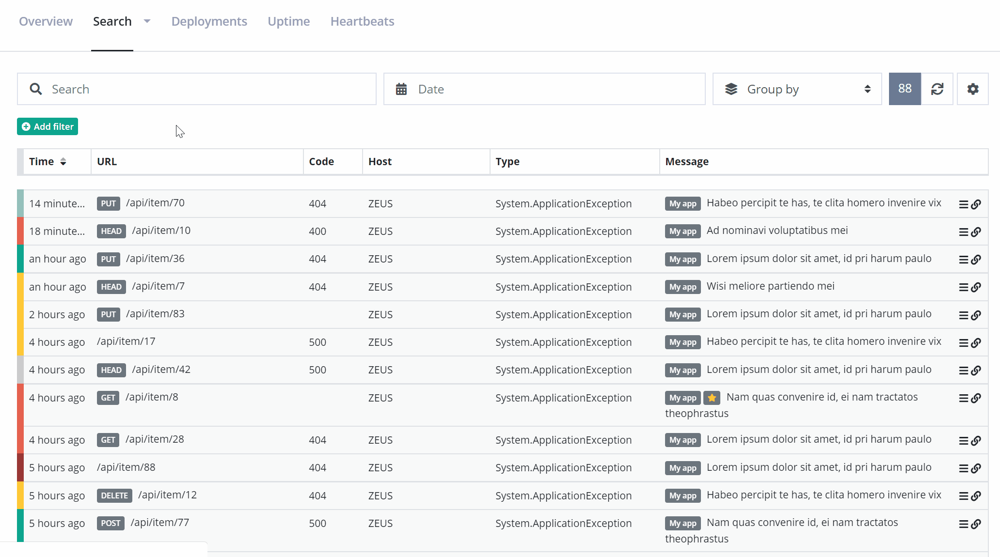
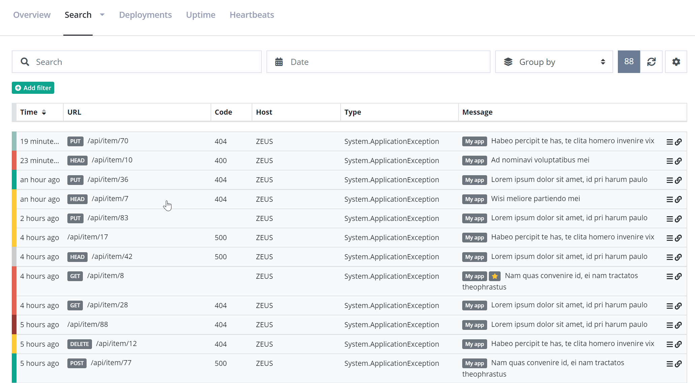

# Query messages using full-text search
All messages sent to elmah.io, are indexed in Elasticsearch. Storing messages in a database like Elasticsearch, opens up a world of possibilities. This article explains how to query your log messages using full-text search, Search Filters and Lucene Query Syntax.

[TOC]

## Full-text search
The easiest approach to start searching your log messages, is by inputting search terms in the _Search_ field on elmah.io:



We don't want to get into too much details on how full-text work in Elasticsearch. In short, Elasticsearch breaks the query into the terms **implement** and **icontroller** and tries to match all log messages including those terms. Full-text search work on _analyzed_ fields in Elasticsearch, which means that wildcards and other constructs are fully supported.

Full-text queries work great. when you want to do a quick search for some keywords like part of an exception message or stacktrace. Remember that the entire log message is search, why a search for _500_ would hit both log messages with status code 500 and the term _500_ in the stacktrace.

## Search Filters

Search filters are built exclusively for elmah.io. They are built on top of Lucene Query Syntax (which we'll discuss in a minute), but much easier to write. Search filters are available through either the *Add filter* button below the search field or using various links and icons on the elmah.io UI.

Let's say we want to find all errors with a status code of 500:



Adding the two filters is possible using a few clicks.

As mentioned previously, search filters are available througout the UI too. In this example, a filter is used to find messages not matching a specified URL:



Search filters can be used in combination with full-text queries for greater flexibility.

## Lucene Query Syntax

Elasticsearch is implemented on top of Lucene; a high-performance search engine, written entirely in Java. While Elasticsearch supports a lot of nice abstractions on top of Lucene, sometime you just want close to the metal. This is when we need to introduce you to Lucene Query Syntax. The query syntax is a query language similar to the _WHERE_ part of a SQL statement. Unlike SQL, the query syntax supports both filters (similar to SQL) and full-text queries.

Basically all Lucene queries are made up of strings containing one or more terms and operators:

```
term AND term OR term
```

While _AND_ and _OR_ pretty much speaks for itself, terms needs a bit of explanation. A term can be a single term or a phrase. We've already seen two single terms in the full-text search example. The query in the example corresponds to this Lucene query:

```
implement AND IController
```

Looking at term phrases, things get really interesting. With phrases, you can query on specific fields, perform range queries and much more. Examples are worth a thousand words, why the rest of this document is examples of frequently used queries. If you think that examples are missing or have a problem with a custom queries, let us know. We will extend this tutorial with the examples you need.

**Find messages with type**

```
type:"System.Web.HttpException"
```

**Find messages with status codes**

```
statusCode:[500 TO 599]
```

**Find messages with URL and method**

```
url:"/tester/" AND method:get
```

**Find messages with URL starting with**

```
url:\/.well-known*
```

Forward slash in the beginning needs to be escaped, since Lucene will understand it as the start of a regex otherwise.

**Find messages by IP**

```
remoteAddr:192.168.0.1
```

**Find messages by IP's**

```
remoteAddr:192.68.0.*
```

The examples above can be achieved using Search Filters as well. We recommend using Search Filters where possible and fall back to Lucene Query Syntax when something isn't supported through filters. An example is using _OR_ which currently isn't possible using filters.