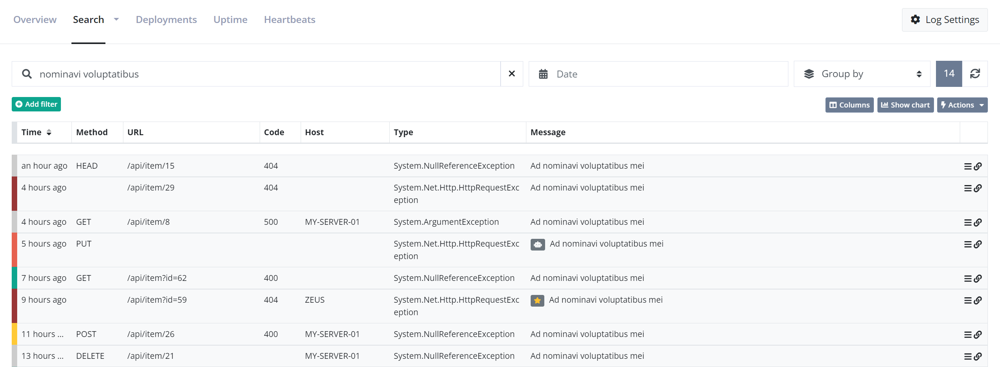
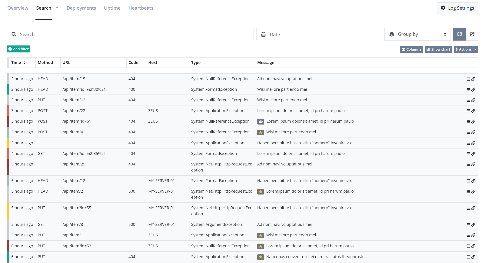

# Query messages using full-text search

All messages sent to elmah.io, are indexed in Elasticsearch. Storing messages in a database like Elasticsearch opens up a world of possibilities. This article explains how to query your log messages using full-text search, Search Filters, and Lucene Query Syntax.

[TOC]

## Full-text search
The easiest approach to start searching your log messages is by inputting search terms in the _Search_ field on elmah.io:



We don't want to get into too much detail on how full-text works in Elasticsearch. In short, Elasticsearch breaks the query into the terms **nominavi** and **voluptatibus** and tries to match all log messages including those terms. Full-text search work on _analyzed_ fields in Elasticsearch, which means that wildcards and other constructs are fully supported.

Full-text queries work great. when you want to do a quick search for some keywords like part of an exception message or stack trace. Remember that the entire log message is search, why a search for _500_ would hit both log messages with status code 500 and the term _500_ in the stack trace.

## Search Filters

Search filters are built exclusively for elmah.io. They are built on top of Lucene Query Syntax (which we'll discuss in a minute), but much easier to write. Search filters are available through either the *Add filter* button below the search field or using various links and icons on the elmah.io UI.

Let's say we want to find all errors with a status code of 500:


Adding the two filters is possible using a few clicks.

As mentioned previously, search filters are available throughout the UI too. In this example, a filter is used to find messages not matching a specified URL:



Search filters can be used in combination with full-text queries for greater flexibility.

## Lucene Query Syntax

Elasticsearch is implemented on top of Lucene; a high-performance search engine, written entirely in Java. While Elasticsearch supports a lot of nice abstractions on top of Lucene, sometimes you just want close to the metal. This is when we need to introduce you to Lucene Query Syntax. The query syntax is a query language similar to the _WHERE_ part of a SQL statement. Unlike SQL, the query syntax supports both filters (similar to SQL) and full-text queries.

All Lucene queries are made up of strings containing full-text search strings and/or terms combined with operators. A simple full-text query simply looks like this:

```
values to search for
```

This will search log messages for 'values', 'to', 'search', and 'for'. For exact searches you can use quotes:

```
"values to search for"
```

This will only find log messages where that exact string is present somewhere.

Queries can also search inside specific fields:

```
field:value
```

This is similar to the _WHERE_ part in SQL and will, in this example, search for the term 'value' inside the field named 'field'.

Both full-text queries and field-based queries can be combined with other queries using `AND`, `OR`, and `NOT`:

```
field1:value1 AND field2:value2 AND NOT field3:value3
```

You can use operators known from C# if you prefer that syntax:

```
field1:value1 && field2:value2 && !field3:value3
```

Full-text and field-based queries can be combined into complex queries:

```csharp
field1:value1 && field2:"exact value" || (field1:value2 && "a full text query")
```

Examples are worth a thousand words, why the rest of this document is examples of frequently used queries. If you think that examples are missing or have a problem with custom queries, let us know. We will extend this tutorial with the examples you need.

**Find messages with type**

```
type:"System.Web.HttpException"
```

**Find messages with status codes**

```
statusCode:[500 TO 599]
```

**Find messages with URL and method**

```
url:"/tester/" AND method:get
```

**Find messages with URL starting with**

```
url:\/.well-known*
```

The forward slash, in the beginning, needs to be escaped, since Lucene will understand it as the start of a regex otherwise.

**Find messages by IP**

```
remoteAddr:192.168.0.1
```

**Find messages by IP's**

```
remoteAddr:192.68.0.*
```

The examples above can be achieved using Search Filters as well. We recommend using Search Filters where possible and falling back to Lucene Query Syntax when something isn't supported through filters. An example is using _OR_ which currently isn't possible using filters.

## Field specification

As already illustrated through multiple examples in this document, all log messages consist of a range of fields. Here's a full overview of all fields, data types, etc. The *.raw* column requires a bit of explanation if you are not familiar with Elasticsearch. Fields that are marked as having *.raw* are indexed for full-text queries. This means that the values are tokenized and optimized for full-text search and not querying by exact values. In this case, a special *raw* field is created for supporting SQL like `WHERE` queries. To illustrate, searching for a part of a user agent would look like this:

```
userAgent:chrome
```

And searching for a specific user agent would look like this:

```
userAgent.raw:"Mozilla/5.0 (Macintosh; Intel Mac OS X 10_9_2) AppleWebKit/537.36 (KHTML, like Gecko) Chrome/36.0.1944.0 Safari/537.36"
```

Here is the full set of fields:

| Name | Type | .raw | Description |
| --- | --- | --- | --- |
| `applicationName` | string | ✅ | Used to identify which application logged this message. You can use this if you have multiple applications and services logging into the same log. |
| `assignedTo` | string | | The id of the user assigned to the log message. elmah.io user IDs are not something that is published on the UI anywhere why this field is intended for the *My errors* dashboard only.
| `browser` | string | ✅ | A short string classifying each log message to a browser. The value can be one of the following: chrome, safari, edge, firefox, opera, ie, other.
| `category` | string | ✅ | The log message category. Category can be a string of choice but typically contain a logging category set by a logging framework like NLog or Serilog. When logging through a logging framework, this field will be provided by the framework and not something that needs to be set manually. |
| `correlationId` | string | | CorrelationId can be used to group similar log messages into a single discoverable batch. A correlation ID could be a session ID from ASP.NET Core, a unique string spanning multiple microservices handling the same request, or similar. |
| `country` | string | | An ISO 3166 two-letter country code in case we could resolve a country from the log message. |
| `detail` | string | | A longer description of the message. For errors, this could be a stack trace, but it's really up to you what to log in there. |
| `domain` | string | | The domain name if it could be resolved from the server variables. |
| `hash` | string | | A unique hash for a log message. The hash is used for multiple things on elmah.io like the new detection. |
| `hidden` | boolean | | A boolean indicating if a log message has been hidden through the UI, the API, or a hide rule. |
| `hostName` | string | ✅ | The hostname of the server logging the message. |
| `isBot` | boolean | | A boolean indicating is a log message is generated by an automated bot or crawler. This flag is set manually through the UI. |
| `isBotSuggestion` | boolean | | A boolean indicating if the log message looks to be generated by an automated bot or crawler. Unlike the `isBot` field, this field is automatically set using machine learning and is available on the Enterprise plan only. |
| `isBurst` | boolean | | A boolean indicating if the log message is a burst. Log messages are automatically marked as burst if we have seen it more than 50 times during the retention period of the purchased plan. |
| `isFixed` | boolean | | A boolean indicating if the log message has been marked as fixed. Log messages can be marked as fixed from the UI.
| `isHeartbeat` | boolean | | A boolean indicating if the log message is logged from the elmah.io Heartbeats feature. |
| `isNew` | boolean | | A boolean indicating if we have seen this unique log message before. |
| `isSpike` | boolean | | A boolean indicating if the log message is logged from the elmah.io Spike feature. |
| `isUptime` | boolean | | A boolean indicating if the log message is logged from the elmah.io Uptime Monitoring feature. |
| `message` | string | ✅ | The textual title or headline of the message to log. |
| `messageTemplate` | string | | The title template of the message to log. This property can be used from logging frameworks that support structured logging like: "{user} says {quote}". In the example, titleTemplate will be this string and the title will be "Gilfoyle says It's not magic. It's talent and sweat". |
| `method` | string | ✅ | If the log message relates to an HTTP request, you may send the HTTP method of that request. If you don't provide us with a method, we will try to find a key named REQUEST_METHOD in serverVariables. |
| `os` | string | ✅ | A short string classifying each log message to an operating system. The value can be one of the following: ios, windows, android, macos, linux, other. |
| `remoteAddr` | string | ✅ | The IP address of the user generating this log message if it can be resolved from server variables. |
| `severity` | string |  | An enum value representing the severity of this message. The following values are allowed: Verbose, Debug, Information, Warning, Error, Fatal. |
| `source` | string | ✅ | The source of the code logging the message. This could be the assembly name. |
| `statusCode` | number | | If the message logged relates to an HTTP status code, you can put the code in this property. This would probably only be relevant for errors but could be used for logging successful status codes as well. |
| `time` | date | | The date and time in UTC of the message. If you don't provide us with a value, this will be set the current date and time in UTC. |
| `type` | string | ✅ | The type of message. If logging an error, the type of the exception would go into type but you can put anything in there, that makes sense for your domain. |
| `url` | string | | If the log message relates to an HTTP request, you may send the URL of that request. If you don't provide us with an URL, we will try to find a key named URL in serverVariables. |
| `user` | string | ✅ | An identification of the user triggering this message. You can put the user's email address or your user key into this property. |
| `userAgent` | string | ✅ | The user agent of the user causing the log message if it can be resolved from server variables. |
| `version` | string | ✅ | Versions can be used to distinguish messages from different versions of your software. The value of the version can be a SemVer compliant string or any other syntax that you are using as your version numbering scheme. |
