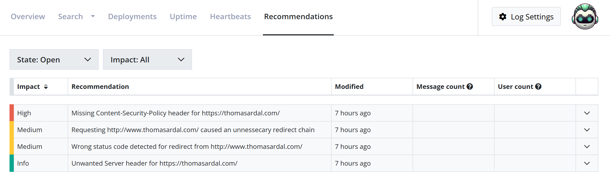
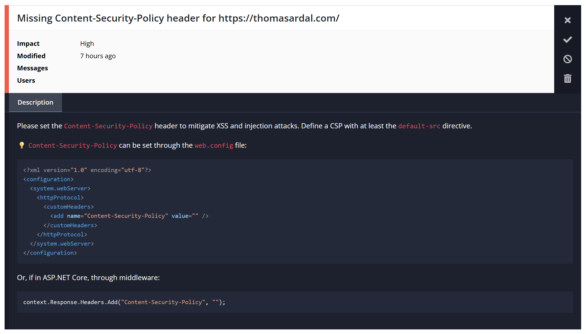

# Recommendations on elmah.io

Maintaining a healthy web application involves more than just fixing errors. Often, underlying configuration issues or missing security headers can lead to vulnerabilities or poor performance. The Recommendations feature collects issues from various elmah.io features to help you improve your software in general.

## What are Recommendations?

While elmah.io is primarily known for error monitoring, the Recommendations features acts as a "virtual consultant". It collects issues from various features like uptime monitoring, SSL checks, configuration mistakes, and more that might not result in a 500 error but still impact the quality of your application.

You can find the list of Recommendations for each log on the log search page and clicking the *Recommendations* tab in the top:

The list provides a high-level overview of all recommendations categorized by:

**Impact**: Helps you prioritize fixes based on severity.

- 🟥 High: Critical security issues or major configuration errors.
- 🟨 Medium: Best practice improvements that should be addressed.
- 🟩 Info: Helpful tips and minor optimizations.

**Modified**: Shows when the issue was last detected or updated.

**Message/User count**: Displays how many log messages or unique users are affected by the identified issue.

You can use the *State* filter (Open/Ignored/Fixed) and the *Impact* filter to change the result of the list.

## Fixing a recommendation

Clicking on any recommendation in the list will expand the row to show a detailed breakdown of the problem and how to fix it.

Each recommendation includes a description of why the issue matters. For example, a recommendation for a missing header will explain the specific attack vector it helps mitigate, such as XSS or injection attacks. In the example above, a missing `Content-Security-Policy` header is identified in a URL part of Uptime Monitoring.

## Managing Recommendation states

Once you have identified a recommendation, you have several options for managing it using the icons on the right-hand side of the details view:

**Mark as Fixed**: If you have implemented a fix, click the checkmark icon to move the recommendation to the *Fixed* state. If the issue is detected again in the future, elmah.io will automatically reopen it.

**Mark as Ignored**: If a recommendation isn't relevant to your specific environment, use the ignore icon to prevent it from cluttering your Open list. Ignored recommendations will not be created again or updated if the issue is still detected.

**Delete recommendation**: Permanently removes the recommendation from the view.

## Recommendation sources

Recommendations can originate from a range of different sources. This will be expanded in the future, but as of now, recommendations can be created from:

- SSL scoring
- Security header checks
- Canonical checks
- Domain expiration checks

## Recommendation Troubleshooting

**Why don't I see any recommendations?**

If the list is empty, it could be for a few reasons:

- Your application might already follow the best practices and security configurations we check for.
- The recommendation engine needs data to work with. If you just created a log, wait at least 24 hours for the engine to scan your traffic patterns.
- As of now, most recommendations comes from the various toggles available when creating a new uptime check. If no uptime checks are created, or features like Canonical check and Security headers check are not enabled, no recommendations are probably created.