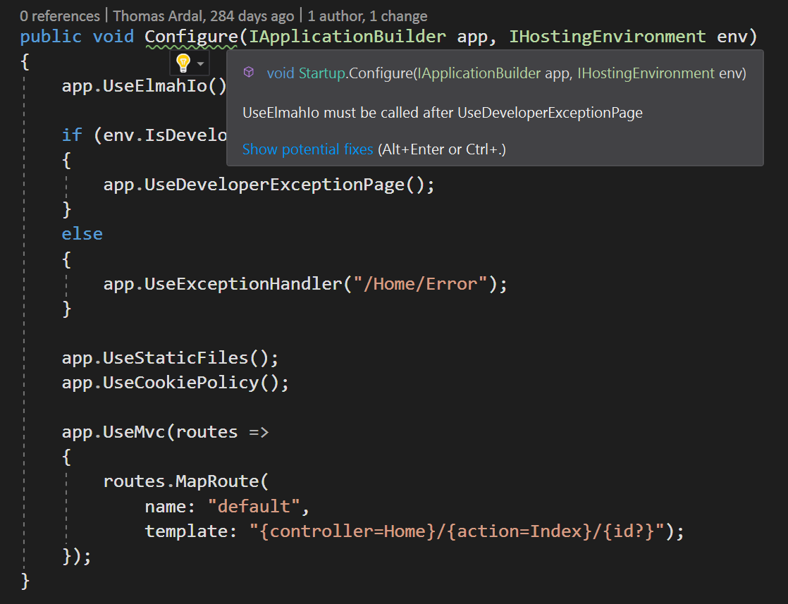

# Roslyn analyzers for elmah.io and ASP.NET Core

[TOC]

To help to install elmah.io in ASP.NET Core (by using the `Elmah.Io.AspNetCore` NuGet package) we have developed a range of Roslyn analyzers. Analyzers run inside Visual Studio and make it possible to validate your `Startup.cs` file during development.

## Installation and usage

To install the analyzers, navigate to *Extensions* | *Manage extensions* | *Online* and search for `Elmah.Io.AspNetCore.Analyzers`. Then click the *Download* button and restart Visual Studio. As an alternative, you can [download the extension](https://marketplace.visualstudio.com/items?itemName=elmahio.elmahioaspnetcoreanalyzers) directly from the Visual Studio Marketplace.

Once installed, analyzers will help you add or move elmah.io-related set up code:



All issues are listed as warnings in the *Error list* as well. The following is an explanation of possible warnings.

## EIO1000 ConfigureServices must call AddElmahIo

`AddElmahIo` needs to be added as part of the `ConfigureServices` method:

```csharp
public void ConfigureServices(IServiceCollection services)
{
    services.AddElmahIo(...); //👈
}
```

## EIO1001 Configure must call UseElmahIo

`UseElmahIo` needs to be added as part of the `Configure` method:

```csharp
public void Configure(IApplicationBuilder app, IHostingEnvironment env)
{
    app.UseElmahIo(); //👈
}
```

## EIO1002 UseElmahIo must be called before/after {1}

`UseElmahIo` needs to be called after any calls to `UseDeveloperExceptionPage`, `UseExceptionHandler`, `UseAuthorization`, and `UseAuthentication` but before any calls to `UseEndpoints` and `UseMvc`:

```csharp
public void Configure(IApplicationBuilder app, IHostingEnvironment env)
{
    if (env.IsDevelopment())
    {
        app.UseDeveloperExceptionPage();
    }
    else
    {
        app.UseExceptionHandler(...);
    }

    app.UseAuthentication();
    app.UseAuthorization();

    app.UseElmahIo(); //👈

    app.UseEndpoints();
    app.UseMvc(...);
}
```