# Set Up Deployment Tracking

[TOC]
    
Deployment tracking creates an overview of the different versions of your software and show you how well each version performed. With this integration in place, you will be able to see when you released and if some of your releases caused more errors than others. While most pages on elmah.io supports everything from verbose to fatal messages, the context on deployment tracking is around warnings and errors.

To set up deployment tracking, you will need to tell elmah.io when you release, using our REST API or one of the integrations. Deployments are as default created on all of your logs, but this can be tweaked. More about this later.

For a complete overview of the possibilities with deployment tracking, watch this video tutorial:

<div class="embed-responsive embed-responsive-16by9">
  <iframe class="embed-responsive-item" src="https://www.youtube.com/embed/vVX_yaLi4f8?rel=0" allowfullscreen></iframe>
</div><br/>

## Generate a new API key

While you can use the same API key for everything, we recommend you to create an API key specific for deployment tracking. To do so, go to the organization settings page by clicking the gears icon next to the organization name on either the dashboard or in the left menu. Select the *API Keys* tabs and click *Add API Key*. Fill in a name of choice and enable the *Deployments* > *Write* permission only:

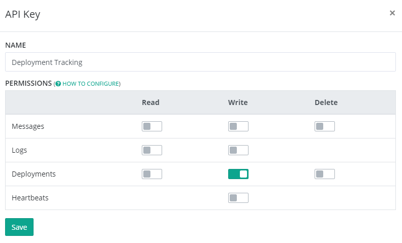

Click the save button and copy the API key for later use.

## Tell elmah.io when you release

When you create a release of your software either manually or with the help from a tool like Octopus, you need to tell elmah.io about it. The [elmah.io REST API v3](https://api.elmah.io/swagger/ui/index), provides an endpoint named `deployments`, which you can call when creating releases. After calling the endpoint, all new messages to your logs, will automatically be decorated with the most recent version number.

### Manually using Swagger UI

If you release your software manually, creating the new release manually is easy using Swagger UI. Swagger UI is a graphical client for calling a Swagger enabled endpoint (much like Postman). Navigate to [https://api.elmah.io/swagger/ui/index](https://api.elmah.io/swagger/ui/index), expand the _Deployments_ node and click the POST request:

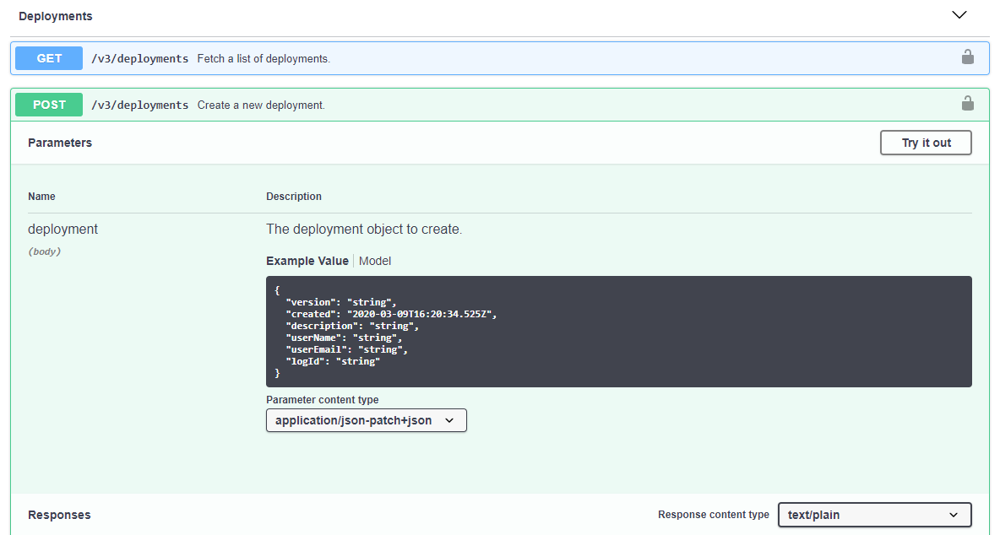

To create the release, input your API key ([Where is my API key?](https://docs.elmah.io/where-is-my-api-key/)) in the top right corner and click the JSON beneath _Model Schema_. This copies the example JSON to the deployment parameter. A minimal deployment would look like the following, but adding more information makes the experience within elmah.io even better:

```json
{
  "version": "1.42.7"
}
```

The version string in the example conforms to SemVer, but the content can be anything. The date of the release is automatically added if not specified in the JSON body.

Click the _Try it out!_ button and the deployment is created.

### Using PowerShell

If you release your software using a build or deployment server, creating the new release is easy using a bit of PowerShell. To request the `deployments` endpoint, write the following PowerShell script:

```powershell
$version = "1.42.7"
$ProgressPreference = "SilentlyContinue"
$url = 'https://api.elmah.io/v3/deployments?api_key=API_KEY'
$body = @{
  version = $version
}
[Net.ServicePointManager]::SecurityProtocol = `
    [Net.SecurityProtocolType]::Tls12,
    [Net.SecurityProtocolType]::Tls11,
    [Net.SecurityProtocolType]::Tls
Invoke-RestMethod -Method Post -Uri $url -Body $body
```

(replace `API_KEY` with your API key found on your organization settings page)

In the example, a simple version string is sent to the API and elmah.io will automatically put a timestamp on that. Overriding user information and description, makes the experience within the elmah.io UI better. Pulling release notes and the name and email of the deployer, is usually available through environment variables or similar, depending on the technology used for creating the deployment.

### Using Kudu

Kudu is the engine behind Git deployments on Microsoft Azure. To create a new elmah.io deployment every time you deploy a new app service to Azure, add a new post deployment script by navigating your browser to `https://yoursite.scm.azurewebsites.net` where `yoursite` is the name of your Azure website. Click the Debug console and navigate to `site\deployments\tools\PostDeploymentActions` (create it if it doesn't exist).

To create the new PowerShell file, write the following in the prompt:

```shell
touch CreateDeployment.ps1
``` 

With a post deployment script running inside Kudu, we have the possibility to extract some more information about the current deployment. A full deployment PowerShell script for Kudu, would look like this:

```powershell
$version = Get-Date -format u

(Get-Content ..\wwwroot\web.config).replace('$version', $version) | Set-Content ..\wwwroot\web.config

$ProgressPreference = "SilentlyContinue"

$commit = [System.Environment]::GetEnvironmentVariable("SCM_COMMIT_MESSAGE");
$commitId = [System.Environment]::GetEnvironmentVariable("SCM_COMMIT_ID");
$httpHost = [System.Environment]::GetEnvironmentVariable("HTTP_HOST");
$deployUrl = "https://$httpHost/api/deployments/$commitId"

$username = "MY_USERNAME"
$password = "MY_PASSWORD"
$base64AuthInfo = [Convert]::ToBase64String([Text.Encoding]::ASCII.GetBytes(("{0}:{1}" -f $username,$password)))

$deployInfo = Invoke-RestMethod -Method Get -Uri $deployUrl -Headers @{Authorization=("Basic {0}" -f $base64AuthInfo)}

$url = 'https://api.elmah.io/v3/deployments?api_key=API_KEY'
$body = @{
  version = $version
  description = $commit
  userName = $deployInfo.author
  userEmail = $deployInfo.author_email
}

[Net.ServicePointManager]::SecurityProtocol = `
    [Net.SecurityProtocolType]::Tls12,
    [Net.SecurityProtocolType]::Tls11,
    [Net.SecurityProtocolType]::Tls
Invoke-RestMethod -Method Post -Uri $url -Body $body
```

(replace `MY_USERNAME` and `MY_PASSWORD` with your Azure deployment credentials and `API_KEY` with your elmah.io API key located on your organization settings page)

The script generates a new version string from the current date and time. How you want your version string looking, is really up to you. To fetch additional information about the deployment, the Kudu `deployments` endpoint is requested with the current commit id. Finally, the script creates the deployment using the elmah.io REST API.

### Using Octopus Deploy

Notifying elmah.io of a new deployment from Octopus Deploy, is supported through a custom step template. To install and configure the template, follow the steps below:

1. Go to the  [elmah.io - Register Deployment](https://library.octopusdeploy.com/step-template/actiontemplate-elmah.io-register-deployment) step template on the Octopus Deploy Library.
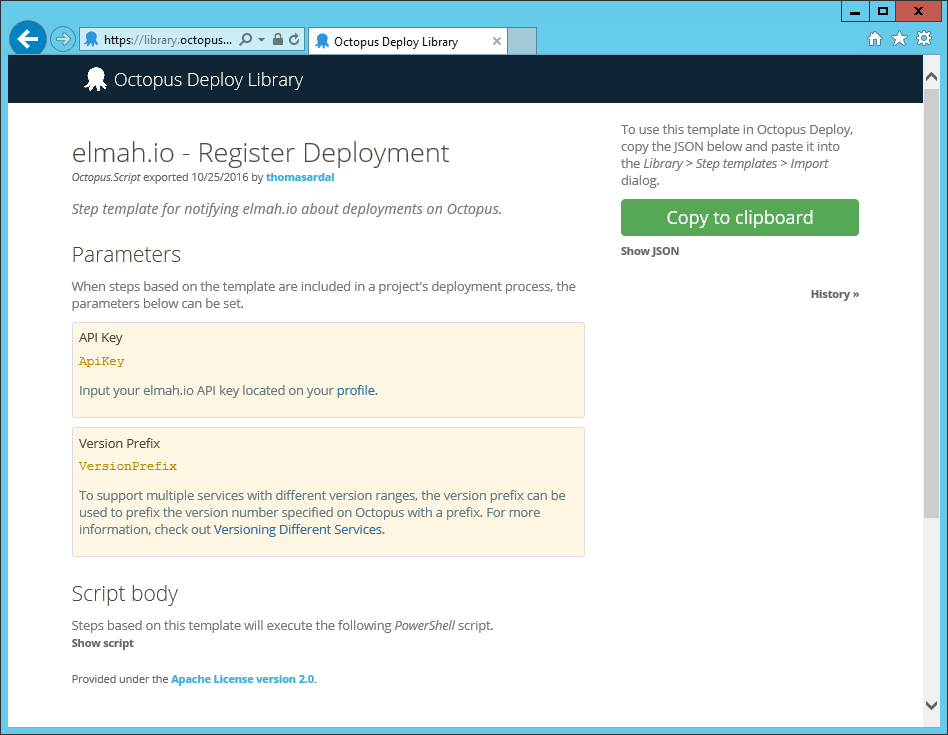

2. Click the _Copy to clipboard_ button.

3. Click _Library_ in the header on your Octopus Deploy instance and go to the _Step templates_ tab.

4. Click the _Import_ link and paste the step template copied from the Library. Then click _Import_.
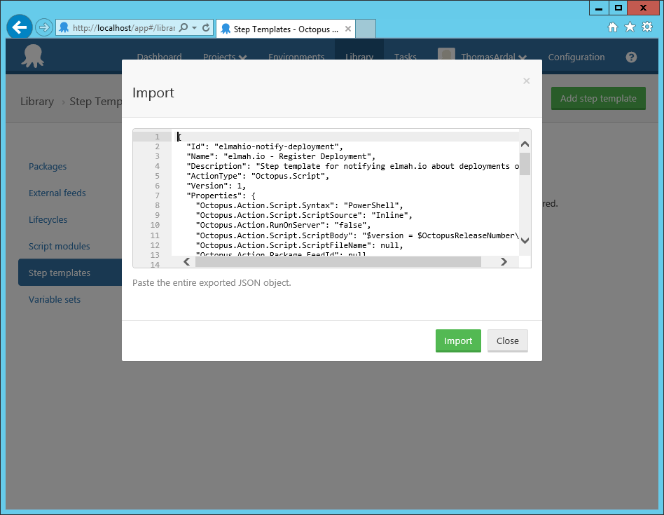

5. Go to the Process tab of your project on Octopus Deploy and click the _Add step_ button. The elmah.io step template is available in the bottom of the list.
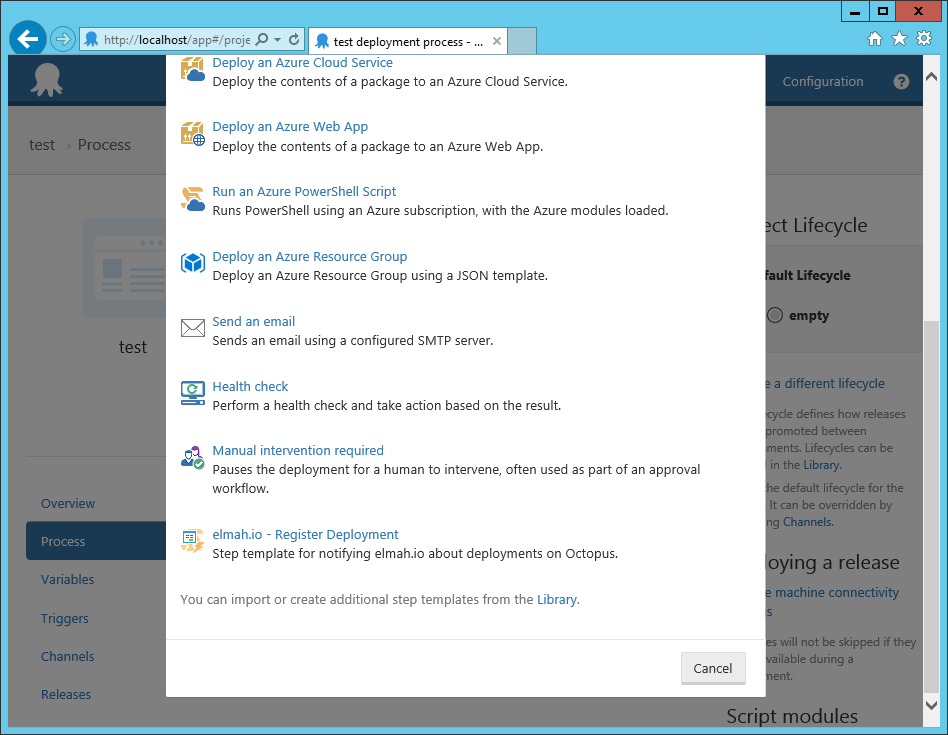

6. When added to the process, select _Octopus Server_ in _Run on_ and input your API key found on your organization settings page. Optionally input a log ID, to [support multiple services](#versioning-different-services).
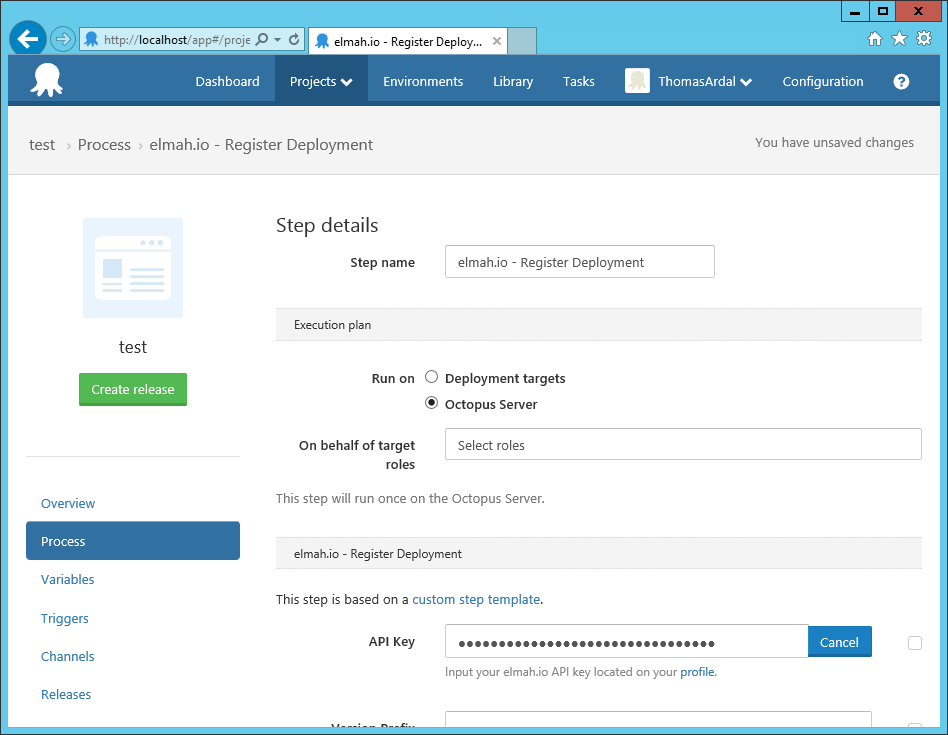

And we're done. On every new deployment, Octopus Deploy will notify elmah.io

### Using Azure DevOps Releases

If you are using Releases in Azure DevOps, you should use our extension to notify elmah.io about new deployments. To install and configure the extension, follow the simple steps below:

1. Go to the [elmah.io Deployment Tasks extension](https://marketplace.visualstudio.com/items?itemName=elmahio.deploy-tasks) on the Visual Studio Marketplace and click _Install_ (log in if not already).
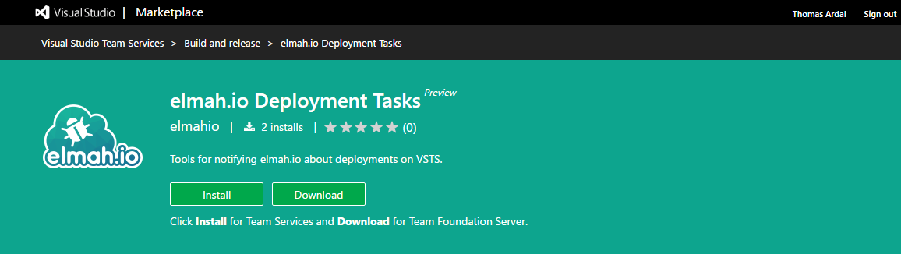

2. Select the account to install the extension into and click _Confirm_:
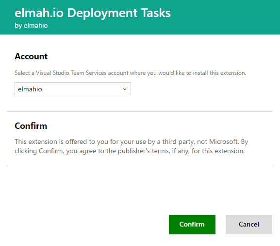

3. Go to your Azure DevOps project and edit your Release definition.
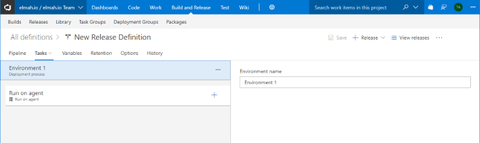

4. Click _Add tasks_ and locate the elmah.io Deployment Notification task. Click _Add_.
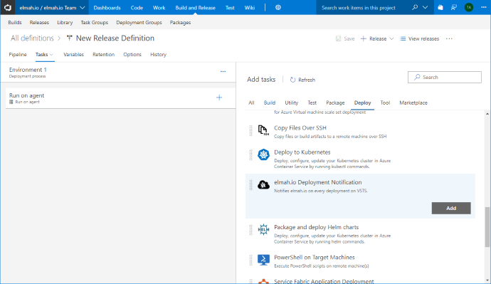

5. Copy your API key from your organization settings page and paste it into the _API Key_ field. In most cases, you want to input the ID of the log new deployments belong to. As default, we use the release name on Azure DevOps as the version number string on elmah.io. If you require a custom naming scheme, change the value in the _Version_ field. All [default and custom release variables](https://docs.microsoft.com/en-us/vsts/build-release/concepts/definitions/release/variables?view=vsts&tabs=batch) are available through PowerShell variables. Finally, click _Save_.
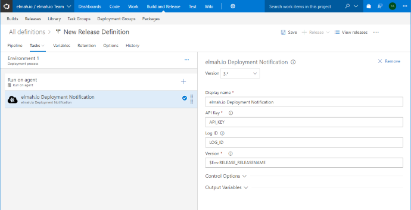

That's it! Azure DevOps will now notify elmah.io every time the release definition is executed. Remember to input a specific log ID as well, if you want to support [versioning different services](#decorate-your-messages-with-a-version-number).

### Using Azure DevOps Builds

Notifying elmah.io about new deployments is possible as a build step in Azure DevOps, by adding a bit of PowerShell:

1. Edit the build definition currently building your project(s).

2. Click the _Add task_ button and locate the _PowerShell_ task. Click _Add_.
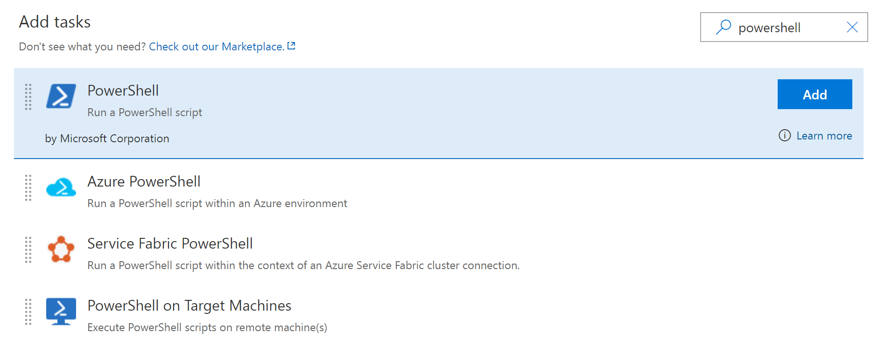

3. Fill in the details as shown in the screenshot.
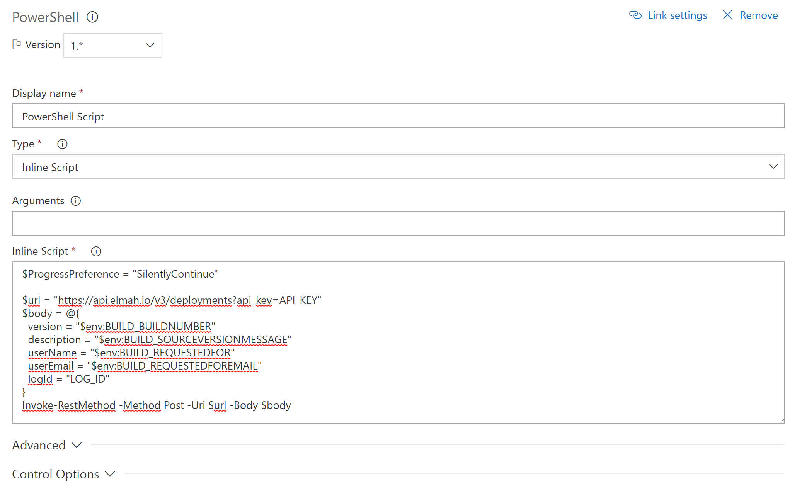

... and here's the code from the screenshot above:

```powershell
$ProgressPreference = "SilentlyContinue"

$url = "https://api.elmah.io/v3/deployments?api_key=API_KEY"
$body = @{
  version = "$env:BUILD_BUILDNUMBER"
  description = "$env:BUILD_SOURCEVERSIONMESSAGE"
  userName = "$env:BUILD_REQUESTEDFOR"
  userEmail = "$env:BUILD_REQUESTEDFOREMAIL"
  logId = "LOG_ID"
}
[Net.ServicePointManager]::SecurityProtocol = `
    [Net.SecurityProtocolType]::Tls12,
    [Net.SecurityProtocolType]::Tls11,
    [Net.SecurityProtocolType]::Tls
Invoke-RestMethod -Method Post -Uri $url -Body $body
```

Replace `API_KEY` with your API key ([Where is my API key?](https://docs.elmah.io/where-is-my-api-key/)) and `LOG_ID` ([Where is my log ID?](https://docs.elmah.io/where-is-my-log-id/)) with the id of the log representing the application deployed by this build configuration.

### Using Umbraco Cloud

Umbraco Cloud uses Azure to host Umbraco websites, why supporting deployment tracking pretty much corresponds the steps specified in [Using Kudu](#using-kudu). Navigate to `https://your-umbraco-site.scm.s1.umbraco.io` where `your-umbraco-site` is the name of your Umbraco site. Click the Debug console link and navigate to `site\deployments\tools\PostDeploymentActions\deploymenthooks` (create it if it doesn't exist). Notice the folder `deploymenthooks`, which is required in order for your scripts to run on Umbraco Cloud.

Unlike Kudu, Umbraco Cloud only executes `cmd` and `bat` files. Create a new `cmd` file:

```shell
touch create-deployment.cmd
```

with the following content:

```shell
echo "Creating elmah.io deployment"

cd %POST_DEPLOYMENT_ACTIONS_DIR%

cd deploymenthooks

powershell -command ". .\create-deployment.ps1"
```

The script executes a PowerShell script, which we will create next:

```shell
touch create-deployment.ps1
```

The content of the PowerShell script looks a lot like in [Using Kudu](#using-kudu), but with some minor tweaks to support Umbraco Cloud:

```powershell
$version = Get-Date -format u

$ProgressPreference = "SilentlyContinue"

$commitId = [System.Environment]::GetEnvironmentVariable("SCM_COMMIT_ID");
$deployUrl = "https://your-umbraco-site.scm.s1.umbraco.io/api/deployments/$commitId"

$username = "MY_USERNAME"
$password = "MY_PASSWORD"
$logId = "LOG_ID"
$base64AuthInfo = [Convert]::ToBase64String([Text.Encoding]::ASCII.GetBytes(("{0}:{1}" -f $username,$password)))

$deployInfo = Invoke-RestMethod -Method Get -Uri $deployUrl -Headers @{Authorization=("Basic {0}" -f $base64AuthInfo)}

$url = 'https://api.elmah.io/v3/deployments?api_key=API_KEY'
$body = @{
  version = $version
  description = $deployInfo.message
  userName = $deployInfo.author
  userEmail = $deployInfo.author_email
  logId = $logId
}

[Net.ServicePointManager]::SecurityProtocol = `
    [Net.SecurityProtocolType]::Tls12,
    [Net.SecurityProtocolType]::Tls11,
    [Net.SecurityProtocolType]::Tls
Invoke-RestMethod -Method Post -Uri $url -Body $body
```

Replace `your-umbraco-site` with the name of your site, `MY_USERNAME` with your Umbraco Cloud username, `MY_PASSWORD` with your Umbraco Cloud password, `LOG_ID` with the id if the elmah.io log that should contain the deployments ([Where is my log ID?](https://docs.elmah.io/where-is-my-log-id/)) and finally `API_KEY` with your elmah.io API key, found and your organization settings page.

There you go. When deploying changes to your Umbraco Cloud site, a new deployment is automatically created on elmah.io.

### Using Bitbucket Pipelines

Pipelines uses scripts, embedded in YAML-files, to configure the different steps required to build and deploy software. To notify elmah.io as part of a build/deployment, the first you will need to do, is to add your API key as a secure environment variable. To do so, go to *Settings* | *Pipelines* | *Environment variables* and add a new variable:


[Where is my API key?](https://docs.elmah.io/where-is-my-api-key/)

Then add a new script to your build YAML-file after building and deploying your software:

```yaml
pipelines:
  default:
    - step:
        script:
          ...
          - curl -X POST -d "{\"version\":\"$BITBUCKET_BUILD_NUMBER\"}" -H "Content-Type:application/json" https://api.elmah.io/v3/deployments?api_key=$ELMAHIO_APIKEY
```

The script uses `curl` to invoke the elmah.io Deployments endpoint with the API key (`$ELMAHIO_APIKEY`) and a version number (`$BITBUCKET_BUILD_NUMBER`). The posted JSON can be extended to support additional properties like changelog and the name of the person triggering the deployment. Check out the [API documentation](http://api.elmah.io/swagger/ui/index) for details.

### Using Atlassian Bamboo

Setting up elmah.io Deployment Tracking on Bamboo, is easy using a bit of PowerShell.

1. Add a new Script Task and select *Windows PowerShell* in *Interpreter*.

2. Select *Inline* in *Script location* and add the following PowerShell to *Script body*:

```powershell
$ProgressPreference = "SilentlyContinue"

Write-Host $bamboo_buildNumber

$url = "https://api.elmah.io/v3/deployments?api_key=API_KEY"
$body = @{
  version = $Env:bamboo_buildNumber
  logId = "LOG_ID"
}
[Net.ServicePointManager]::SecurityProtocol = `
    [Net.SecurityProtocolType]::Tls12,
    [Net.SecurityProtocolType]::Tls11,
    [Net.SecurityProtocolType]::Tls
Invoke-RestMethod -Method Post -Uri $url -Body $body
```


Replace `API_KEY` and `LOG_ID` and everything is configured. The script uses the build number of the current build as version number (`$Env:bamboo_buildNumber`). If you prefer another scheme, Bamboo offers a range of <a href="https://confluence.atlassian.com/bamboo/bamboo-variables-289277087.html" target="_blank" rel="noopener noreferrer">variables</a>.

## Decorate your messages with a version number

As default, all messages are decorated with the most recent deployment version. If you want to override this behavior, check out [Adding Version Information](https://docs.elmah.io/adding-version-information/) for details.

## Versioning Different Services

Chances are that your software consists of multiple services released independently and with different version numbers. This is a common pattern when splitting up a software system in microservices. How you choose to split your elmah.io logs are entirely up to you, but we almost always recommend having a separate log for each service. When doing so, you only want deployment tracking to show the releases from the service you are currently looking at. The problem here is that deployments on elmah.io are shown on all logs as default.

To make sure that only deployments related to the service you are looking at are shown, you need to decorate each deployment with the log ID where it belong. The `deployments` API support this through an optional `logId` property. If set, the new deployment is only shown on the specified log.