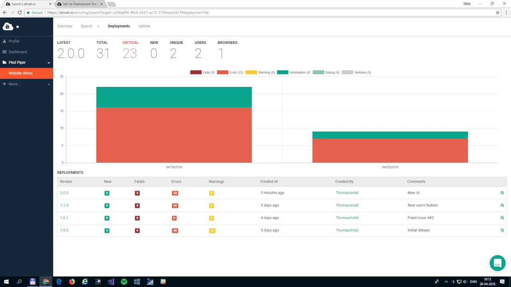
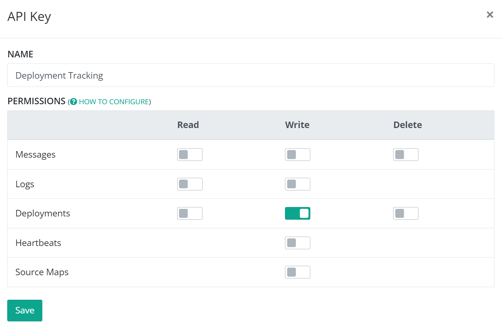
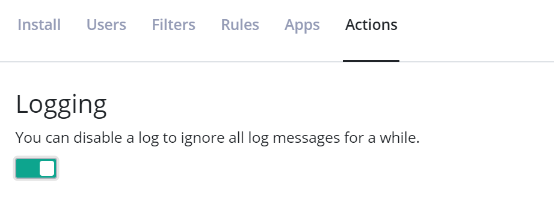

# Set Up Deployment Tracking

[TOC]
    
Deployment tracking creates an overview of the different versions of your software and shows you how well each version performed. With this integration in place, you will be able to see when you released and if some of your releases caused more errors than others. While most pages on elmah.io support everything from verbose to fatal messages, the context on deployment tracking is around warnings and errors.

To set up deployment tracking, you will need to tell elmah.io when you release, using our REST API or one of the integrations:

<div class="guides-boxes row">
    <div class="guide-col col-4 col-sm-3 col-md-4 col-lg-3 col-xl-2">
        <a href="/create-deployments-from-powershell/" title="PowerShell">
            <div class="guide-box">
                <div class="guide-image">
                    
                </div>
                <div class="guide-title">PowerShell</div>
            </div>
        </a>
    </div>
    <div class="guide-col col-4 col-sm-3 col-md-4 col-lg-3 col-xl-2">
        <a href="/create-deployments-from-octopus-deploy/" title="Octopus Deploy">
            <div class="guide-box">
                <div class="guide-image">
                    
                </div>
                <div class="guide-title">Octopus Deploy</div>
            </div>
        </a>
    </div>
    <div class="guide-col col-4 col-sm-3 col-md-4 col-lg-3 col-xl-2">
        <a href="/create-deployments-from-azure-devops-releases/" title="Azure DevOps">
            <div class="guide-box">
                <div class="guide-image">
                    
                </div>
                <div class="guide-title">Azure DevOps</div>
            </div>
        </a>
    </div>
    <div class="guide-col col-4 col-sm-3 col-md-4 col-lg-3 col-xl-2">
        <a href="/create-deployments-from-github-actions/" title="GitHub Actions">
            <div class="guide-box">
                <div class="guide-image">
                    
                </div>
                <div class="guide-title">GitHub Actions</div>
            </div>
        </a>
    </div>
    <div class="guide-col col-4 col-sm-3 col-md-4 col-lg-3 col-xl-2">
        <a href="/create-deployments-from-umbraco-cloud/" title="Umbraco Cloud">
            <div class="guide-box">
                <div class="guide-image">
                    
                </div>
                <div class="guide-title">Umbraco Cloud</div>
            </div>
        </a>
    </div>
    <div class="guide-col col-4 col-sm-3 col-md-4 col-lg-3 col-xl-2">
        <a href="/create-deployments-from-bitbucket-pipelines/" title="Bitbucket Pipelines">
            <div class="guide-box">
                <div class="guide-image">
                    
                </div>
                <div class="guide-title">Bitbucket Pipelines</div>
            </div>
        </a>
    </div>
    <div class="guide-col col-4 col-sm-3 col-md-4 col-lg-3 col-xl-2">
        <a href="/create-deployments-from-atlassian-bamboo/" title="Bamboo">
            <div class="guide-box">
                <div class="guide-image">
                    
                </div>
                <div class="guide-title">Bamboo</div>
            </div>
        </a>
    </div>
    <div class="guide-col col-4 col-sm-3 col-md-4 col-lg-3 col-xl-2">
        <a href="/create-deployments-from-cli/" title="elmah.io CLI">
            <div class="guide-box">
                <div class="guide-image">
                    
                </div>
                <div class="guide-title">elmah.io CLI</div>
            </div>
        </a>
    </div>
    <div class="guide-col col-4 col-sm-3 col-md-4 col-lg-3 col-xl-2">
        <a href="/create-deployments-from-kudu/" title="Kudu">
            <div class="guide-box">
                <div class="guide-image">
                    
                </div>
                <div class="guide-title">Kudu</div>
            </div>
        </a>
    </div>
    <div class="guide-col col-4 col-sm-3 col-md-4 col-lg-3 col-xl-2">
        <a href="/create-deployments-from-azure-devops-pipelines/" title="Azure Pipelines">
            <div class="guide-box">
                <div class="guide-image">
                    
                </div>
                <div class="guide-title">Azure Pipelines</div>
            </div>
        </a>
    </div>
    <div class="guide-col col-4 col-sm-3 col-md-4 col-lg-3 col-xl-2">
        <a href="/create-deployments-from-azure-devops-releases/" title="Azure Releases">
            <div class="guide-box">
                <div class="guide-image">
                    
                </div>
                <div class="guide-title">Azure Releases</div>
            </div>
        </a>
    </div>
    <div class="guide-col col-4 col-sm-3 col-md-4 col-lg-3 col-xl-2">
        <a href="/create-deployments-from-gitlab-pipelines/" title="GitLab Pipelines">
            <div class="guide-box">
                <div class="guide-image">
                    
                </div>
                <div class="guide-title">GitLab Pipelines</div>
            </div>
        </a>
    </div>
</div>

Deployments are as default created on all of your logs, but this can be tweaked. More about this later.

For a complete overview of the possibilities with deployment tracking, watch this video tutorial:

<a class="video-box" data-fancybox="" href="https://www.youtube.com/watch?v=vVX_yaLi4f8&amp;autoplay=1&amp;rel=0" title="deployment-tracking">
  
  <i class="fad fa-play-circle"></i>
</a>

## Generate a new API key

While you can use the same API key for everything, we recommend you create an API key specific to deployment tracking. To do so, go to the organization settings page by clicking the gears icon next to the organization name on either the dashboard or in the left menu. Select the *API Keys* tabs and click *Add API Key*. Fill in a name of choice and enable the *Deployments* > *Write* permission only:



Click the save button and copy the API key for later use.

## Tell elmah.io when you release

When you create a release of your software either manually or with the help of a tool like Octopus, you need to tell elmah.io about it. The [elmah.io REST API v3](https://api.elmah.io/swagger/index.html) provides an endpoint named `deployments`, which you can call when creating releases. After calling the endpoint, all new messages to your logs will automatically be decorated with the most recent version number.

If you release your software manually, creating the new release manually is easy using Swagger UI. Swagger UI is a graphical client for calling a Swagger-enabled endpoint (much like Postman). Navigate to [https://api.elmah.io/swagger/index.html](https://api.elmah.io/swagger/index.html), expand the _Deployments_ node and click the POST request:


To create the release, input your API key ([Where is my API key?](https://docs.elmah.io/where-is-my-api-key/)) in the top right corner and click the JSON beneath _Model Schema_. This copies the example JSON to the deployment parameter. A minimal deployment would look like the following, but adding more information makes the experience within elmah.io even better:

```json
{
  "version": "1.42.7"
}
```

The version string in the example conforms to SemVer, but the content can be anything. The date of the release is automatically added if not specified in the JSON body.

Click the _Try it out!_ button and the deployment is created.

We support a range of different integrations to avoid you manually having to use Swagger UI every time you release. Click one of the products below for instructions:

- [PowerShell](/create-deployments-from-powershell/)
- [Octopus Deploy](/create-deployments-from-octopus-deploy/)
- [Kudu](/create-deployments-from-kudu/)
- [Azure DevOps Pipelines](/create-deployments-from-azure-devops-pipelines/)
- [Azure DevOps Releases](/create-deployments-from-azure-devops-releases/)
- [GitHub Actions](/create-deployments-from-github-actions/)
- [Umbraco Cloud](/create-deployments-from-umbraco-cloud/)
- [Bitbucket Pipelines](/create-deployments-from-bitbucket-pipelines/)
- [Atlassian Bamboo](/create-deployments-from-atlassian-bamboo/)

## Decorate your messages with a version number

As default, all messages are decorated with the most recent deployment version. If you want to override this behavior, check out [Adding Version Information](https://docs.elmah.io/adding-version-information/) for details.

## Versioning Different Services

Chances are that your software consists of multiple services released independently and with different version numbers. This is a common pattern when splitting up a software system in microservices. How you choose to split your elmah.io logs is entirely up to you, but we almost always recommend having a separate log for each service. When doing so, you only want deployment tracking to show the releases from the service you are currently looking at. The problem here is that deployments on elmah.io are shown on all logs as default.

To make sure that only deployments related to the service you are looking at are shown, you need to decorate each deployment with the log ID where it belongs. The `deployments` API supports this through an optional `logId` property. If set, the new deployment is only shown on the specified log.

## Enable/Disable logging while deploying

Some websites and services are not built to work properly while deploying a new version. This may cause errors logged from Uptime Monitoring and similar while you deploy a new version of your software. In this case, you might consider disabling logging while deploying and enable logging once the new version is deployed. Disabling logging can be done in two ways:

1. Through the elmah.io UI on the log settings page:

    

2. By calling the [Disable](https://api.elmah.io/swagger/index.html#/Logs/Logs_Disable) and [Enable](https://api.elmah.io/swagger/index.html#/Logs/Logs_Enable) endpoints on the API (either manually or automatically). Powershell examples for reference:

```powershell
# Disable logging
Invoke-RestMethod -Method Post -Uri 'https://api.elmah.io/v3/logs/LOG_ID/_disable?api_key=API_KEY'

# Enable logging
Invoke-RestMethod -Method Post -Uri 'https://api.elmah.io/v3/logs/LOG_ID/_enable?api_key=API_KEY'
```