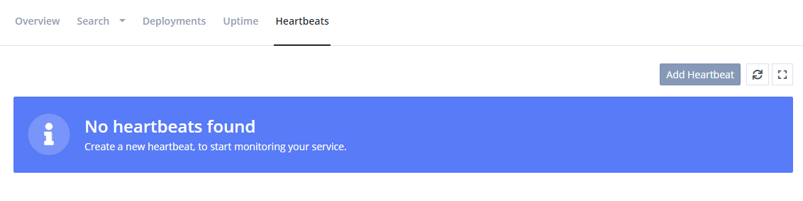
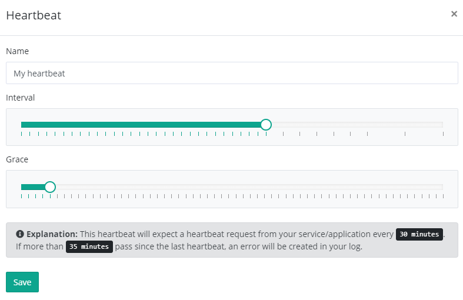
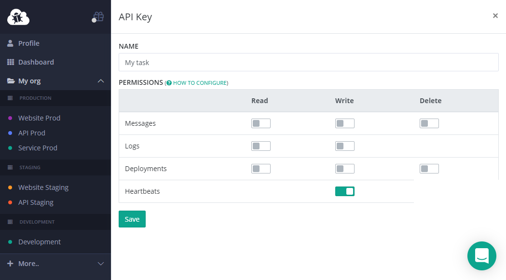

# Set up Heartbeats

[TOC]

> The Heartbeats feature is currently in beta and still experimental.

elmah.io Heartbeats complements the Error Logging and Uptime Monitoring features already available on elmah.io. Where Uptime Monitoring is based on us pinging your public HTTP endpoints, Heartbeats is the other way around. When configured, your services, scheduled tasks, and websites ping the elmah.io in a specified interval. We call these ping Heartbeats, hence the name of the feature. Whether you should use Uptime Monitoring or Heartbeats to monitor your code, depends on a range of variables. Uptime Monitoring is great at making sure that your public endpoints can be reached from multiple locations. Scheduled tasks and services typically don't have public endpoints and are expected to run at a specified interval. With Heartbeats, setting up monitoring on this kind of services is extremely easy, since elmah.io will automatically detect when an unhealthy heartbeat is received or if no heartbeat is received.

Click one of the integrations below or continue reading to learn more about Heartbeats:

<div class="guides-boxes row">
    <div class="guide-col col-4 col-sm-3 col-md-4 col-lg-3 col-xl-2">
        <a href="/logging-heartbeats-from-asp-net-core/" title="ASP.NET Core">
            <div class="guide-box">
                <div class="guide-image">
                    
                </div>
                <div class="guide-title">ASP.NET Core</div>
            </div>
        </a>
    </div>
    <div class="guide-col col-4 col-sm-3 col-md-4 col-lg-3 col-xl-2">
        <a href="/logging-heartbeats-from-azure-functions/" title="Azure Functions">
            <div class="guide-box">
                <div class="guide-image">
                    
                </div>
                <div class="guide-title">Functions</div>
            </div>
        </a>
    </div>
    <div class="guide-col col-4 col-sm-3 col-md-4 col-lg-3 col-xl-2">
        <a href="/logging-heartbeats-from-powershell/" title="PowerShell">
            <div class="guide-box">
                <div class="guide-image">
                    
                </div>
                <div class="guide-title">PowerShell</div>
            </div>
        </a>
    </div>
    <div class="guide-col col-4 col-sm-3 col-md-4 col-lg-3 col-xl-2">
        <a href="/logging-heartbeats-from-curl/" title="cURL">
            <div class="guide-box">
                <div class="guide-image">
                    
                </div>
                <div class="guide-title">cURL</div>
            </div>
        </a>
    </div>
    <div class="guide-col col-4 col-sm-3 col-md-4 col-lg-3 col-xl-2">
        <a href="/logging-heartbeats-from-umbraco/" title="Umbraco">
            <div class="guide-box">
                <div class="guide-image">
                    
                </div>
                <div class="guide-title">Umbraco</div>
            </div>
        </a>
    </div>
    <div class="guide-col col-4 col-sm-3 col-md-4 col-lg-3 col-xl-2">
        <a href="/logging-heartbeats-from-hangfire/" title="Hangfire">
            <div class="guide-box">
                <div class="guide-image">
                    
                </div>
                <div class="guide-title">Hangfire</div>
            </div>
        </a>
    </div>
    <div class="guide-col col-4 col-sm-3 col-md-4 col-lg-3 col-xl-2">
        <a href="/logging-heartbeats-from-net-core-worker-services/" title="Worker Services">
            <div class="guide-box">
                <div class="guide-image">
                    
                </div>
                <div class="guide-title">Worker Services</div>
            </div>
        </a>
    </div>
</div>

To better understand Heartbeats, let's create a simple example. For detailed instructions on how to set up Heartbeats in different languages and frameworks, select one of the specific articles in the left menu.

In this example, we will extend a C# console application, executed as a Windows Scheduled task, with a heartbeat. The scheduled task is run every 30 minutes.

Open a log on elmah.io and navigate to the *Heartbeats* tab:



Click the *Add Heartbeat* button and fill in a name. For *Interval* we are selecting 30 minutes since the task is scheduled to run every 30 minutes. For *Grace*, we select 5 minutes to give the task a chance to complete. Selecting 30 and 5 minutes means that elmah.io will log an error if more than 35 minutes pass since we last heard from the task:



In order to create heartbeats from our task, we will need an API key, a log ID and a heartbeat ID. Let's start with the API key. Go to the organization settings page and click the *API Keys* tab. Add a new API key and check the *Heartbeats - Write* permission only:



Copy and store the API key somewhere. Navigate back to your log and click the *Instructions* link on the newly created Heartbeat. This will reveal the log ID and heartbeat ID. Copy and store both values since we will need them in a minute.

Time to do the integration. Like mentioned before, there are multiple ways of invoking the API. For this example, we'll use C#. Install the `Elmah.Io.Client` NuGet package:

```ps
Install-Package Elmah.Io.Client
```

Extend your C# with the following code:

```csharp
using Elmah.Io.Client;
using Elmah.Io.Client.Models;

public class Program
{
    public static void Main()
    {
        var logId = new Guid("LOG_ID");
        var api = ElmahioAPI.Create("API_KEY");
        try
        {
            // Your task code goes here

            api.Heartbeats.Healthy(logId, "HEARTBEAT_ID");
        }
        catch (Exception e)
        {
            api.Heartbeats.Unhealthy(logId, "HEARTBEAT_ID");
        }
    }
}
```

Replace `LOG_ID`, `API_KEY`, and `HEARTBEAT_ID` with the values stored in the previous steps.

When the code runs without throwing an exception, your task now creates a `Healthy` heartbeat. If an exception occurs, the code creates an `Unhealthy` heartbeat and uses the exception text as the reason. There's an additional method named `Degraded` for logging a degraded heartbeat.

Depending on the heartbeat status, a log message can be created in the configured log. Log messages are only created on state changes. This means that if logging two `Unhealthy` requests, only the first request triggers a new error. If logging a `Healthy` heartbeat after logging an `Unhealthy` heartbeat, an information message will be logged. Transitioning to `Degraded` logs a warning.

## Additional properties

### Reason

The `Healthy`, `Unhealthy`, and `Degraded` methods (or the `CreateHeartbeat` class when using the raw `Create` method) accepts an additional parameter named `reason`.

`reason` can be used to specify why a heartbeat check is either `Degraded` or `Unhealthy`. If your service throws an exception, the full exception including its stack trace is a good candidate for the `reason` parameter. When using integrations like the one with ASP.NET Core Health Checks, the health check report is used as the reason of the failing heartbeat.

### Application and Version

When logging errors through one or more of the integrations, you may already use the `Application` and/or `Version` fields to set an application name and software version on all messages logged to elmah.io. Since Heartbeats will do the actual logging of messages in this case, you can configure it to use the same application name and/or version number as your remaining integrations.

```csharp
api.Heartbeats.Unhealthy(logId, "HEARTBEAT_ID", application: "MyApp", version: "1.0.0");
```

If application name is not configured, all messages logged from Heartbeats will get a default value of `Heartbeats`. If no version number is configured, log messages from Heartbeats will be assigned the latest version created through [Deployment Tracking](https://elmah.io/features/deploymenttracking/).