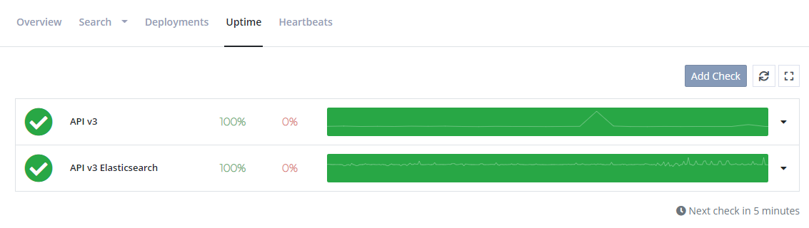

# Set Up Uptime Monitoring

[TOC]

elmah.io Uptime Monitoring is the perfect companion for error logging. When your websites log errors, you are notified through elmah.io. But in the case where your website doesn't even respond to web requests, you will need something else to tell you that something is wrong. This is where Uptime Monitoring comes in. When set up, uptime monitoring automatically pings your websites from 5 different locations every 5 minutes.

For a complete overview of the possibilities with uptime monitoring, watch this video tutorial:

  <iframe class="embed-responsive-item" src="https://www.youtube.com/embed/EZ9iNfB9Blw?rel=0" allowfullscreen></iframe>

## Uptime checks

Uptime checks are automatic HTTP requests that you may already know from Azure, Pingdom, or a similar service. Uptime checks are created from the Uptime tab, directly on each log:

## SSL certificate expire checks

Expiring SSL certificates cause errors in your user's browser. If you ever tried forgetting to renew an SSL certificate, you know how many problems it can cause. With the SSL check option available when creating a new uptime check, elmah.io automatically validates your SSL certificates daily.

When your SSL certificate is up for renewal, we start notifying you through the error logs.

## Domain name expires checks

Much like SSL checks, Domain name expire checks, will notify you through your log when your domain names are about to expire. To enable this feature, enable the *Domain Expiration* toggle when creating a new uptime check.