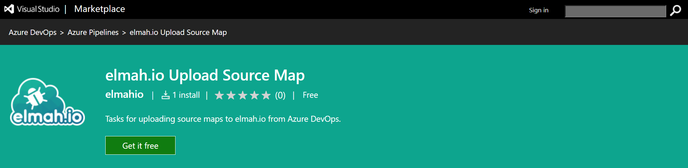
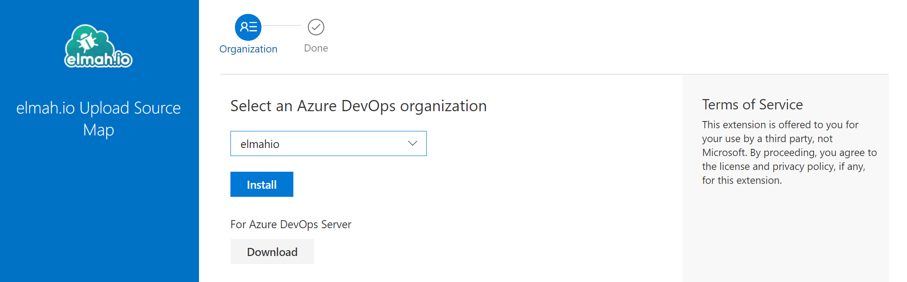
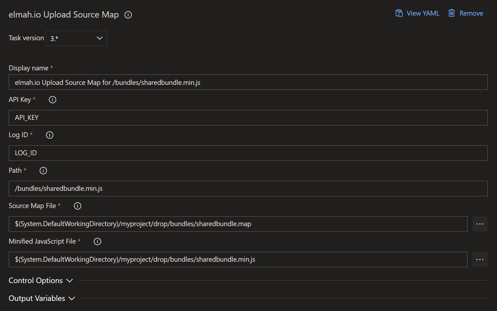

# Source maps

[TOC]

`elmah.io.javascript` automatically tries to translate stack traces from minified and/or bundled code into developer-friendly traces using JavaScript source maps. For this to work, you will need to publish a valid `.map` source map file to either your web server or through the elmah.io API. In this article, we go through each of the possibilities.

This is not a guide for generating source map files. There's a range of possibilities to help you do that (like `gulp`).

## Publish to your web server

The easiest way for `elmah.io.javascript` to translate minified/bundled stack traces is to publish a JavaScript source map alongside your minified JavaScript file. When logging a message through `elmah.io.javascript`, a source map is automatically used if there is a `.map` reference at the end of the file causing the log message/error:

```javascript
var v = 42;
//# sourceMappingURL=/script.map
```

This will require you to serve a source map file named `script.map` together with the minified/bundled file. The `.map` file doesn't need to be publicly available over the internet, but the `elmah.io.javascript` package will need to have access to it.

> De-minification from a `.map` file doesn't work in older browsers (like < IE10).

## Upload to elmah.io

> Uploading source maps to elmah.io is currently in beta.

Publishing source map files alongside your minified and bundled files is not always the preferred way of doing things. With both the minified JavaScript file and the source map, someone outside of your organization can reverse engineer your JavaScript. In cases where this would be critical or if you want to limit the size of the published files, you can choose to upload the minified/bundled file and the corresponding source map file on the elmah.io API. When elmah.io receives a stack trace from a minified JavaScript file, we try to de-minify it if a corresponding `.min.js` and `.map` file have been uploaded.

The code in the following sections will use the following bundled and minified stack trace as an example:

```javascript
Error: You cannot copy to the clipboard
    at window.copyTextToClipboard (https://foo.bar/bundles/sharedbundle.min.js:69:24978)
    at MyViewModel.n.copy (https://foo.bar/bundles/viewmodels.min.js:37:37385)
    at HTMLButtonElement.<anonymous> (https://foo.bar/bundles/sharedbundle.min.js:55:109467)
```

To upload a source map to elmah.io you will need an API key with the *Source Maps* | *Write* permission enabled. We recommend creating a new API key with this permission enabled only. For more information about API keys and permissions, check out [How to configure API key permissions](https://docs.elmah.io/how-to-configure-api-key-permissions/).

### Upload through the API

Go to the [API](https://api.elmah.io/swagger/index.html) and insert your API key. The [upload source map](https://api.elmah.io/swagger/index.html#/SourceMaps/SourceMaps_CreateOrUpdate) endpoint accepts a couple of parameters that you will need to get right to make de-minification work.

The stack trace contains references to two different bundled JavaScript files with each their `.map` file. Both source map files should be uploaded to the elmah.io API.

For both bundled files, fill in the details as explained here:

| Parameter | Description |
|---|---|
| logId | A source map will always belong to a specific elmah.io log. Insert the log ID of that log in this field. If an application is logging JavaScript messages to multiple logs, you will need to upload the files to all those logs. |
| Path | This is the relative path to the bundled and minified file. For the example above you will need to specify `/bundles/sharedbundle.min.js` for the first source map and `/bundles/viewmodels.min.js` for the second one. You can use an absolute path and query parameters on the URL if you prefer, but this will be converted to a relative path by the elmah.io API. |
| SourceMap | The source map file representing the minified file in the `Path` specified above. |
| MinifiedJavaScript | The bundled and minified JavaScript file. This will be the content of the `Path` specified above. |

### Upload from PowerShell

Uploading source maps can be built into your CI/CD pipeline using cURL, PowerShell, or similar. Here's an example written in PowerShell:

```ps
$boundary = [System.Guid]::NewGuid().ToString()
$mapPath = "c:\path\to\sharedbundle.map"
$jsPath = "c:\path\to\sharedbundle.min.js"

$mapFile = [System.IO.File]::ReadAllBytes($mapPath)
$mapContent = [System.Text.Encoding]::UTF8.GetString($mapFile)
$jsFile = [System.IO.File]::ReadAllBytes($jsPath)
$jsContent = [System.Text.Encoding]::UTF8.GetString($jsFile)

$LF = "`r`n"
$bodyLines = (
    "--$boundary",
    "Content-Disposition: form-data; name=`"Path`"$LF",
    "/bundles/sharedbundle.min.js",
    "--$boundary",
    "Content-Disposition: form-data; name=`"SourceMap`"; filename=`"sharedbundle.map`"",
	"Content-Type: application/json$LF",
    $mapContent,
    "--$boundary",
    "Content-Disposition: form-data; name=`"MinifiedJavaScript`"; filename=`"sharedbundle.min.js`"",
	"Content-Type: text/javascript$LF",
    $jsContent,
    "--$boundary--$LF"
) -join $LF

Invoke-RestMethod 'https://api.elmah.io/v3/sourcemaps/LOG_ID?api_key=API_KEY' -Method POST -ContentType "multipart/form-data; boundary=`"$boundary`"" -Body $bodyLines
```

### Upload from C\#

Source maps can be uploaded from C# using the `Elmah.Io.Client` NuGet package:

```csharp
var api = ElmahioAPI.Create("API_KEY");

using var sourceMapStream = File.OpenRead("c:\\path\\to\\sharedbundle.map");
using var scriptStream = File.OpenRead("c:\\path\\to\\sharedbundle.min.js");

api.SourceMaps.CreateOrUpdate(
    "LOG_ID",
    new Uri("/bundles/sharedbundle.min.js", UriKind.Relative),
    new FileParameter(sourceMapStream, "sharedbundle.map", "application/json"),
    new FileParameter(scriptStream, "sharedbundle.min.js", "text/javascript"));
```

### Upload from Azure DevOps

Uploading one or more source maps from Azure DevOps is available using our integration with Pipelines. Here is a guide to help you upload source maps from Azure DevOps. Before you can include the upload source map task, you will need to publish your generated source maps and minified JavaScript files from your build pipeline.

1. Go to the [elmah.io Upload Source Map](https://marketplace.visualstudio.com/items?itemName=elmahio.elmah-io-upload-source-map) extension on the Azure DevOps Marketplace and click the _Get it free_ button:



2. Select your organization and click the *Install* button:



3. Go to your Azure DevOps project and add the *elmah.io Upload Source Map* task. Fill in all fields as shown here:



### Upload from GitHub Actions

Uploading one or more source maps from GitHub Actions is available using our integration with Actions. We recommend adding your API key and log ID as secrets on your GitHub repository, to avoid people outside of your organization getting access to those values.

To upload a generated source map from GitHub Actions, include the following in your build YAML file:

```yml
uses: elmahio/github-upload-source-map-action@v1
with:
  apiKey: ${{ secrets.ELMAH_IO_API_KEY }}
  logId: ${{ secrets.ELMAH_IO_LOG_ID }}
  path: '/bundles/sharedbundle.min.js'
  sourceMap: 'path/to/sharedbundle.map'
  minifiedJavaScript: 'path/to/sharedbundle.min.js'
```