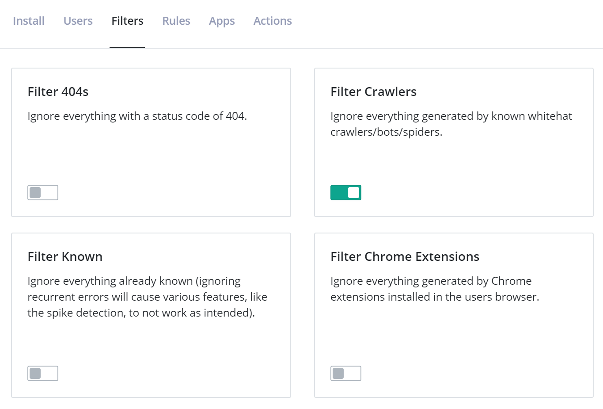
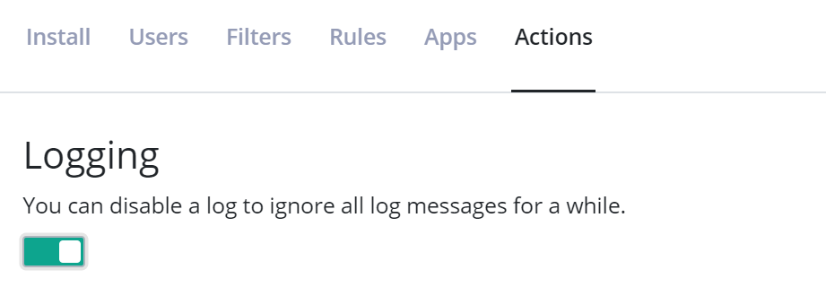

# Tips and tricks to stay below your message limit

[TOC]

Each plan on elmah.io includes a maximum number of messages per month. The number of messages is calculated from how many times your applications have called our API and successfully stored a message (in most cases messages equal errors). Deleting messages either one by one or in batches is fully supported, but does not result in a decrease in the current message count. Our costs are primarily around receiving, indexing, and notifying about messages, why we cannot allow someone on a lower plan like the Small Business, to log millions and yet millions of messages and then just clean up regularly. We're sure that everyone understands the challenge here.

With that said, we want to help you stay within your message limits. Luckily, there are a lot of ways to limit messages. This article contains a list of the most common tactics to stay below your message limit.

## Ignore Rules

!!! note
    Be aware that Ignore rules and filters are only meant as a temporary way of ignoring messages. In case you want to permanently ignore one or more log messages, use [client-side filtering](#client-side-message-filtering).

The easiest way to limit logged messages is by ignoring some of them. Ignored messages do not count toward the message limit. Message rules can be configured through the Rules tab on the Log Settings view.

Rules consist of a query and an action. The query can either be a full-text query or written using Lucene Query Syntax. To create a new ignore rule, input a query on the Rules tab:


All new rules are created with an ignore action as default, why you don't need to click the *Then* link for this type of rule. In the example above, ignore all messages with a status code of `404`.

For more information about the possibilities with rules, check out [Creating Rules to Perform Actions on Messages](creating-rules-to-perform-actions-on-messages.md).

## Filters

Filters are Ignore Rules in disguise. With Filters, we have collected the most common ignore rules and made them available as a set of checkboxes. To ignore all messages matching a specific filter, enable one of the checkboxes on the Filters tab on Log Settings:



If your website is available for everyone to access, ignoring known crawlers, bots, and spiders is a good idea in most cases. Filtering below warning can also be a good idea unless you are using elmah.io to log all log severities from a logging framework like NLog or Serilog.

If staying within the message limit is more important than getting the full picture of the errors generated by your website, there are a couple of filters that will help you with that. The *Filter Known* filter will make sure that only one instance of each error is logged. If you still want to log multiple instances but stop at some point, the *Filter Burst* filter will stop logging after 50 instances are logged. Finally, you can set a limit on how many errors you want logged to a specific log each month, by inputting a number in the *Filter Limit* filter. Please notice that using any of these last three filters will cause inconsistent results in different graphs and features (like spike detection). They can solve the problem of logging too much, but it is a sign that you are logging more data than is included in your plan. A perfectly valid solution is to purchase a larger plan, get your logging under control (maybe even fix some errors?), and then downgrade when you are ready.

## Ignore future messages like this

Sometimes you may find yourself on the Search tab with a search result thinking: "I don't care about these messages". By clicking the caret next to the query filters, an *Ignore future messages like this* option is revealed:


Clicking this option automatically ignores any future messages matching your current search result.

## Disable logs

Each log can be disabled from Log Settings:



Disabled logs are shown as semi-transparent on the dashboard, to help you remember that you disabled a log.

## Client-side message filtering

Most of our clients support client filtering. All of the filtering options described above filter messages server-side. This means that your application still communicates with elmah.io's API and needs to wait for that to answer (even for ignored messages).

Filtering client-side from ASP.NET, MVC, Web API, and other frameworks built on top of ASP.NET, can be done using ELMAH's (the open-source project) [filtering](https://code.google.com/p/elmah/wiki/ErrorFiltering) feature. To filter messages, create a method named `ErrorLog_Filtering` in the `Global.asax.cs` file:

```csharp
void ErrorLog_Filtering(object sender, ExceptionFilterEventArgs args)
{
    var httpContext = args.Context as HttpContext;
    if (httpContext.Response.StatusCode == 404)
    {
        args.Dismiss();
    }
}
```

If you're using ASP.NET Core, our client supports the `OnFilter` action:

```csharp
builder.Services.AddElmahIo(o =>
{
    // ...
    o.OnFilter = message =>
    {
        return message.StatusCode == 404;
    };
});
```

To help you set up client-side filtering in commonly used logging frameworks, click the <kbd><span class="fa fa-filter"></span></kbd> button on the log message details toolbar. This will show a dialog containing extensive help on setting up client-side filtering.

## Monitor current usage

We send you an email when you have used 90% of your limit and again when reaching the limit. Monitoring your usage is a good supplement to the emails since you can react early on (by upgrading, ignoring errors, or something else). There's a usage graph on the *Organization Settings* view:


By clicking the information icon above the counter, you will be able to see which logs that are taking up space:


## Fix bugs

Seeing the same error over and over again? Maybe the best idea is to fix it :) I mean, that's the whole purpose of elmah.io: to help you fix bugs. And remember, the fewer bugs you have, the cheaper elmah.io gets. The ultimate motivation!

## Purchase a top-up

Sometimes, a spike in errors can be caused by unexpected events like a black hat bot deciding to bombard your site with requests or a junior dev on your team accidentally enabling verbose logging. In these cases, purchasing a top-up may be a better solution than permanently upgrading your plan. Top-ups can be purchased from the *Subscription* tab on the *Organization Settings* page. Top-ups are purchased in bundles of 25,000 messages, valid for the rest of the calendar month.

## Upgrading to the next plan

If you constantly go over the limit, you have probably reached a point where you will need to upgrade to a larger plan. You can upgrade and downgrade at any time, so upgrading for a few months (until you get errors under control) and then downgrading again, is perfectly fine.