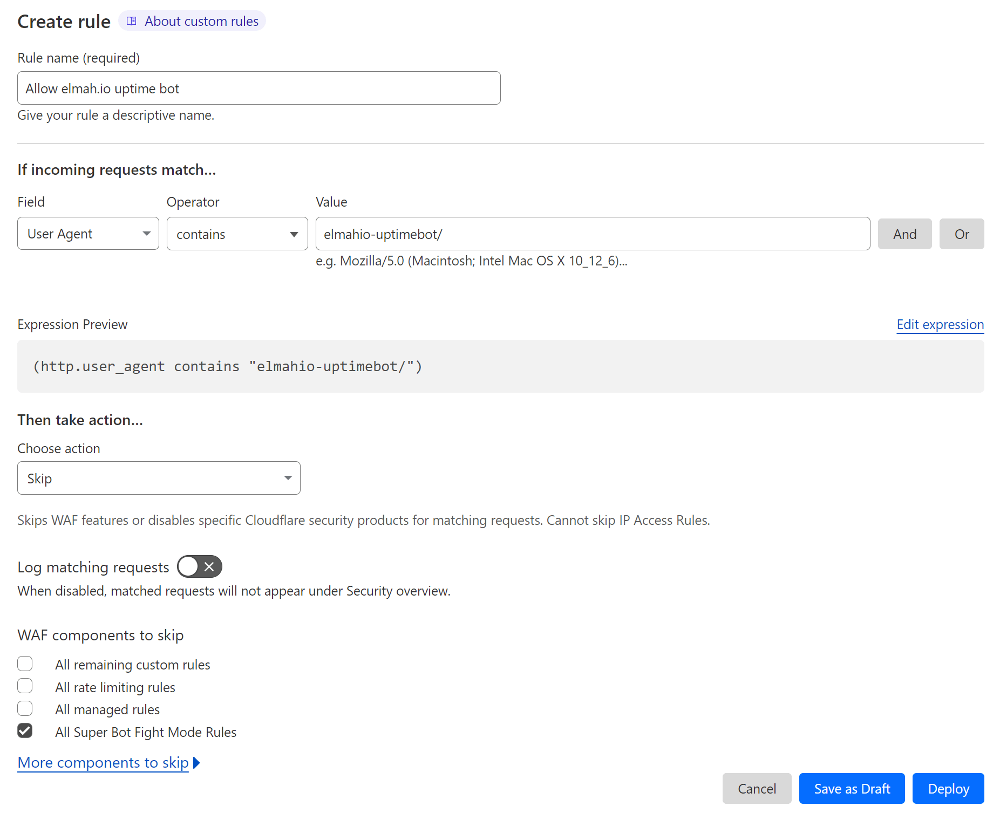

# Uptime Monitoring Troubleshooting

## Cloudflare Super Bot Fight Mode disallows the elmah.io uptime user-agent

We have tried to get Cloudflare to adopt the elmah.io Uptime user-agent as an allowed bot. This is not possible since bots need to come from a fixed set of IPs which is not possible when hosting on Microsoft Azure.

To allow the elmah.io Uptime user-agent you can create a new firewall rule. To do so go to *Security* | *WAF* and select the *Custom rules* tab. Click the *Create rule* button and input the following values:

