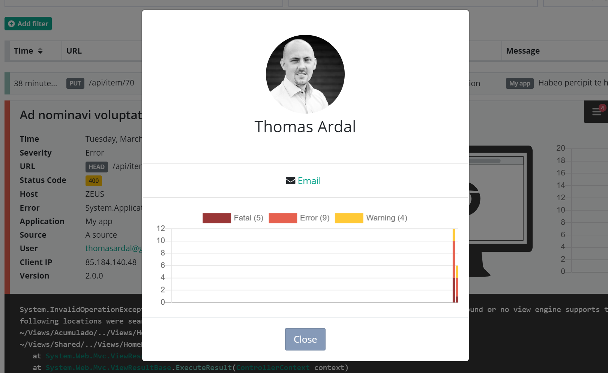

# Use Extended User Details without Email as Id

Most of our integrations automatically logs the user identity as part of the error. To make that happen, packages typically use the identity object on the current thread, which gets set by most authentication frameworks for .NET (like ASP.NET Membership Provider and ASP.NET Core Identity). You may use the user's email as key or a database identifier. If you are using an email, you are already covered and able to see Extended User Details. If not, you need to provide elmah.io with a little help.

In order to tell elmah.io about the user's email and still keeping the identifier in the user field, you can enrich the message with a piece of custom data, before sending it off to elmah.io. By putting the user's email in a *Data* item named `X-ELMAHIO-USEREMAIL` Extended User Details will pick this up and show the correct user. How you set the *Data* item is dependent of the elmah.io NuGet package you are using.

For ASP.NET, MVC, or Web API, the code could look like this:

```csharp
Elmah.ErrorLog.GetDefault(null); // Forces creation of logger client
var logger = ErrorLog.Client;
logger.OnMessage += (sender, args) =>
{
    if (string.IsNullOrWhiteSpace(args.Message.User)) return;
    var db = ...;
    var user = db.GetById<User>(args.Message.User);
    args.Message.Data.Add(new Item {Key = "X-ELMAHIO-USEREMAIL", Value = user.Email});
}
```

For ASP.NET Core the code could look like this:

```csharp
services.AddElmahIo(o =>
{
    // ...
    o.OnMessage = message =>
    {
        if (string.IsNullOrWhiteSpace(message.User)) return;
        var db = ...;
        var user = db.GetById<User>(message.User);
        message.Data.Add(new Item {Key = "X-ELMAHIO-USEREMAIL", Value = user.Email});
    };
});
```

`OnMessage` event handlers are executed just before a message is send to elmah.io. In the body of the event handler, the user's email is fetched from the database by calling the `GetById` method. How you will be able to convert the user ID to an email depends on your tech stack, but you get the picture.

That's it! A few lines of code and you are able to watch every little details about the users experiencing problems on your website:


