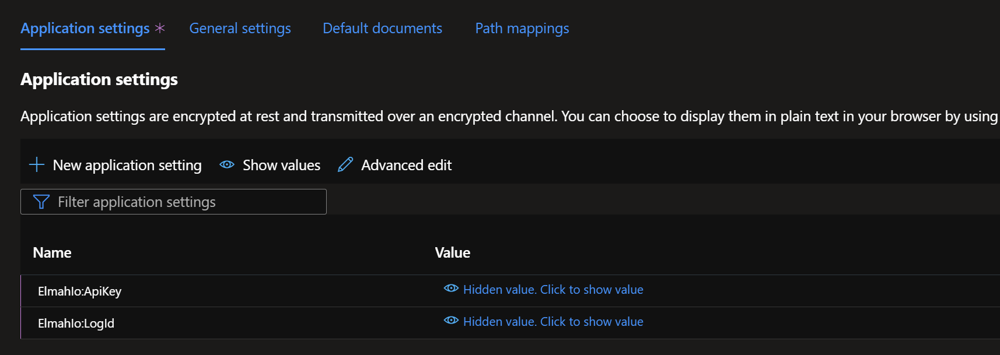

# Using different logs per environment in ASP.NET Core

We are often asked the question: Should I create a log per environment and how do I set it up with ASP.NET Core?

Creating a log per environment (staging, production, etc.) is a good idea since you probably want different notification rules and/or user access depending on the environment. This document provides a range of possibilities for setting up a log per environment.

> This document is intended for the `Elmah.Io.AspNetCore` package only. You can use the same approach for `Elmah.Io.Extensions.Logging` but we recommend using log filtering in the `appsettings.json` file or through C# instead.

## Using appsettings.{Environment}.json

All ASP.NET Core websites read an environment variable named `ASPNETCORE_ENVIRONMENT`. The value can be used to set config variables depending on the current environment. The feature works a bit like Web.config transformations that you may remember from the good old ASP.NET days. The value of `ASPNETCORE_ENVIRONMENT` can be tailored to your need but the following three values are provided out of the box: `Development`, `Staging`, and `Production`.

To only add elmah.io when on staging or production, you can add the following code when setting up the elmah.io middleware:

```csharp
if (builder.Environment.IsProduction() || builder.Environment.IsStaging())
{
    app.UseElmahIo();
}
```

To create errors in different logs depending on the current environment, create two new files: `appsettings.staging.json` and `appsettings.production.json`. Add the `ElmahIo` config section to both files:

```json
{
  "ElmahIo": {
    "ApiKey": "API_KEY",
    "LogId": "LOG_ID"
  }
}
```

Inside each file, replace `API_KEY` with your API key and `LOG_ID` with the different log IDs.

The downside of this approach is that you have your production API key and log ID in source control.

## Using Azure Application settings

If you are hosting on Azure (other cloud hosting platforms have a similar feature), you can utilize the built-in Application settings feature to avoid adding API keys and log IDs to source control. Using application settings requires you to specify your elmah.io configuration in the `appsettings.json` file or one of the environment-specific files as shown above.

To replace the values inside the `ApiKey` and `LogId` properties, use the colon syntax as shown here:



(replace `API_KEY` and `LOG_ID` with your staging or production values depending on which environment you are configuring)