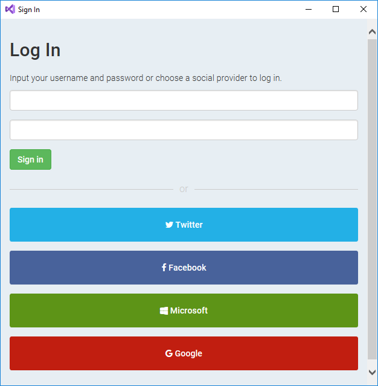
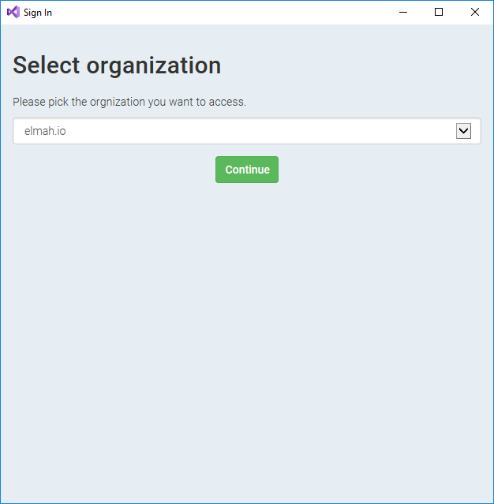
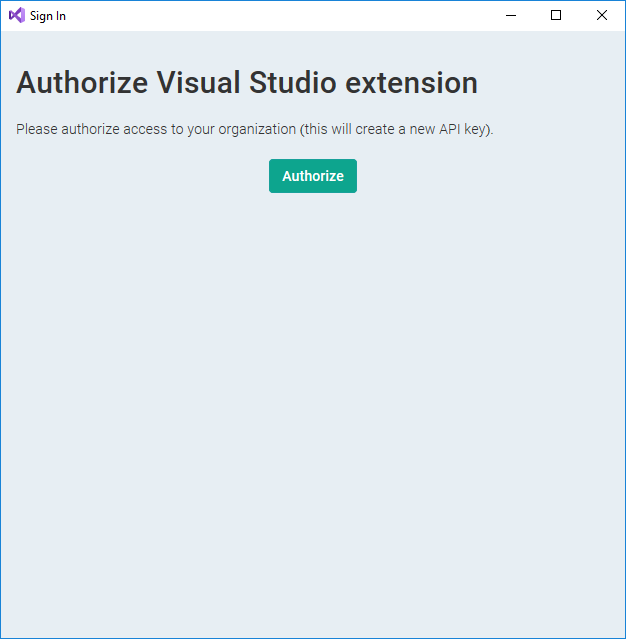
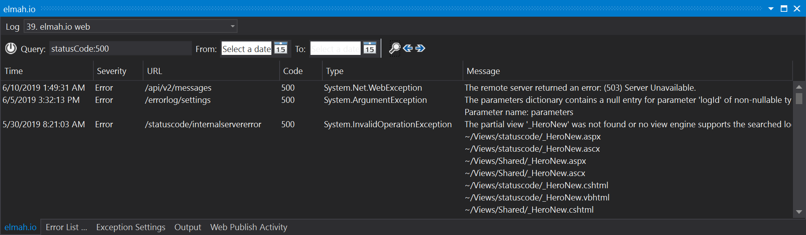
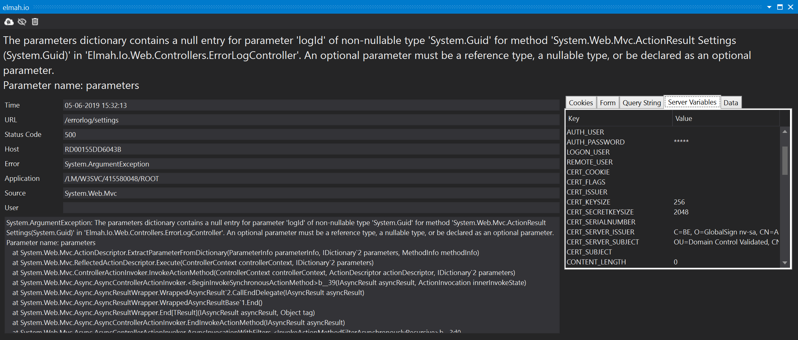

# Using the elmah.io extension for Visual Studio

Being able to focus on .NET developers makes it possible to do all kinds of cool things. Like building an elmah.io extension for Visual Studio. That's exactly what we've done and here's how to use it.

## Installation

Download the elmah.io extension for [Visual Studio ≤ 2019](https://marketplace.visualstudio.com/items?itemName=elmahio.elmahio) or [Visual Studio 2022](https://marketplace.visualstudio.com/items?itemName=elmahio.elmahiobrowser2022) from the Visual Studio Marketplace.

!!! note
    Don't use the Extensions and Updates feature inside Visual Studio, since Visual Studio causes a problem with installing extensions in previous versions.

Double/click the downloaded VSIX and enable elmah.io in the versions of Visual Studio of your choice. The extension supports Visual Studio 2015, 2017, 2019, and 2022.

## Usage

Inside Visual Studio navigate to View | Other Windows | elmah.io or simply search for elmah.io in the Quick Launcher (<kbd>Ctrl</kbd> + <kbd>Q</kbd>).

You'll see the elmah.io window somewhere. Click the *Sign In* button and sign in with a username/password or one of the social providers:

If you are part of multiple elmah.io organizations, select the one you want to access: 

If this is the first time someone is browsing the chosen organization from Visual Studio, authorize the creation of a new API key:

Once logged in, the list of logs is populated with all of your logs defined at elmah.io. Select a log and click the search icon:

Log messages can be filtered by date range, full-text search, and using Lucene query language as already known from the elmah.io UI. 

To inspect a single message, double-click it and the message details window will open:

The toolbar at the top provides a couple of options: View the message on elmah.io, hide the message and delete the message.
