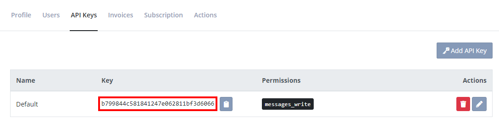

# Where is my API key?

API keys are a new concept introduced with version 3.x of our [API](https://elmah.io/api/). API keys are located on the organization settings page.

To open organization settings, click the gears icon next to your organization name on either the left menu or through the dashboard:

When on the organization settings page, click the _API Keys_ tab and copy your API key:

This view also lets you generate new API keys and revoke an existing key, if you believe that the key is compromised.