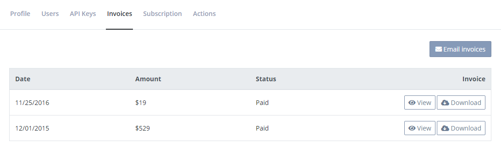

# Where is my invoice/receipt?

Invoices are located on the organization settings page.

To open organization settings, click the gears icon next to your organization name on either the left menu or through the dashboard:

When on the organization settings page, click the _Invoices_ tab:

There's a row per invoice in the table on this page. You can open or download the invoice using the links to the right.

If you want invoices emailed to you (or your accountant) every time a payment is made, click the *Email invoices* button and input an email address.