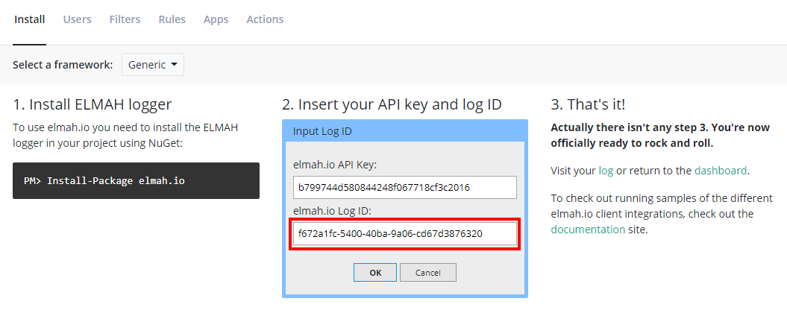

# Where is my log ID?

A log ID represents a log on elmah.io. A log is a container for log messages. How you choose to split up your logs is totally up to you, but creating a log per application/service is what most users do.

The log ID is located on the log settings page. To open log settings, click the gears icon next to the log name in the menu or in the log box on the dashboard:

When clicking on the icon, you are taken directly to the _Install_ tab:

