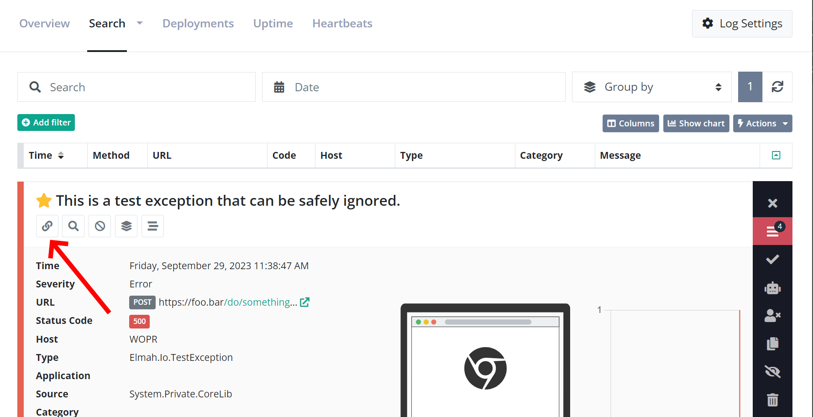
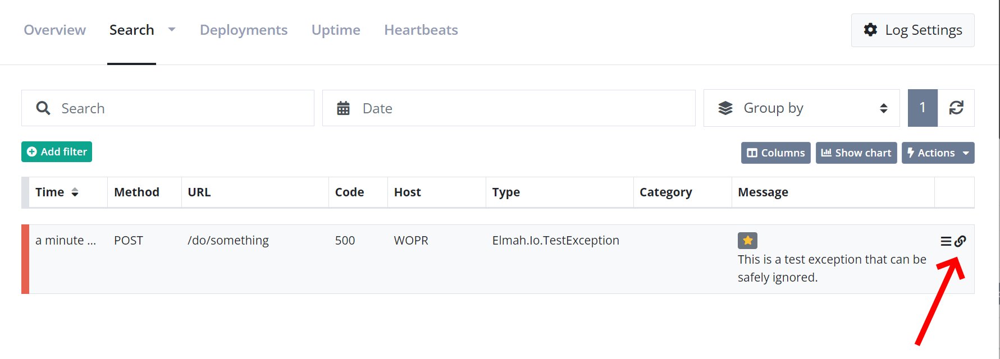

# Where is the permalink button

A permalink is a link to a specific log message on elmah.io. When generating a permalink, the log message will be shown in expanded form on the log search page. To get the permalink, go to the log search page and click a log message to expand the details. Beneath the log message, there's a permalink button that will open the message in a new tab:

You can also get a permalink directly from the search result:

